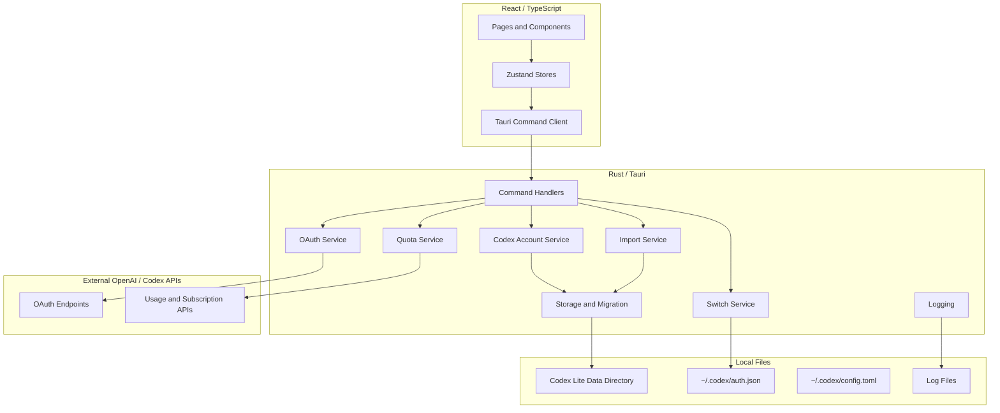
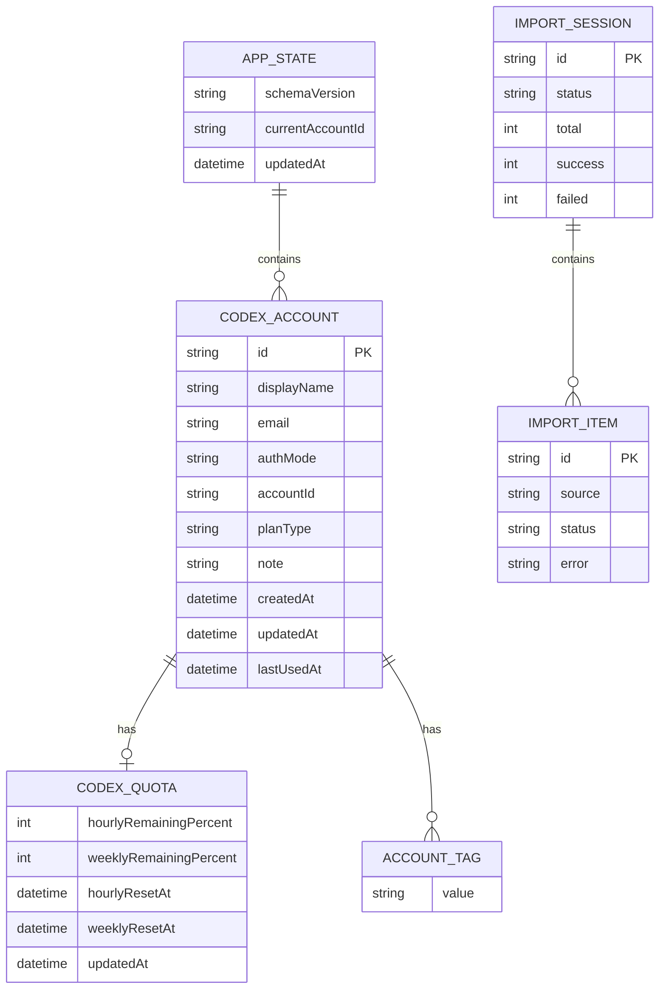
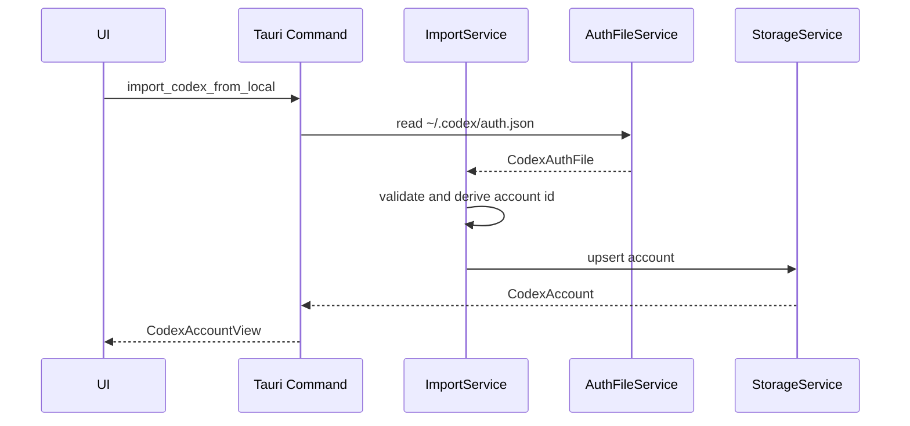
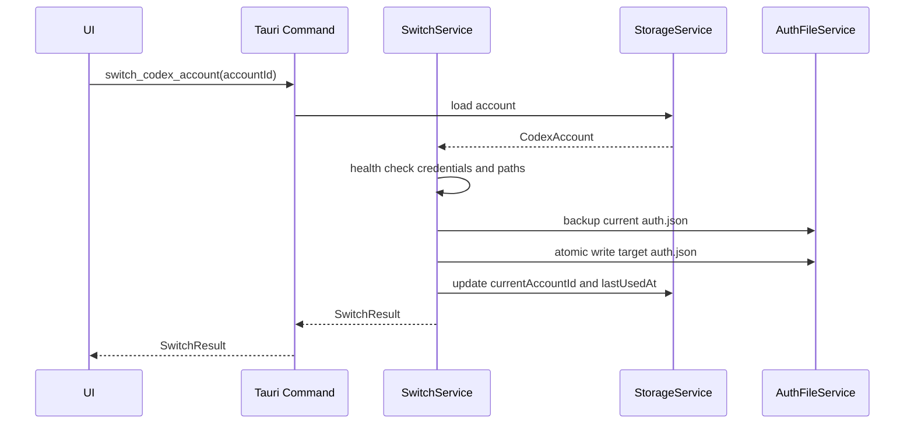
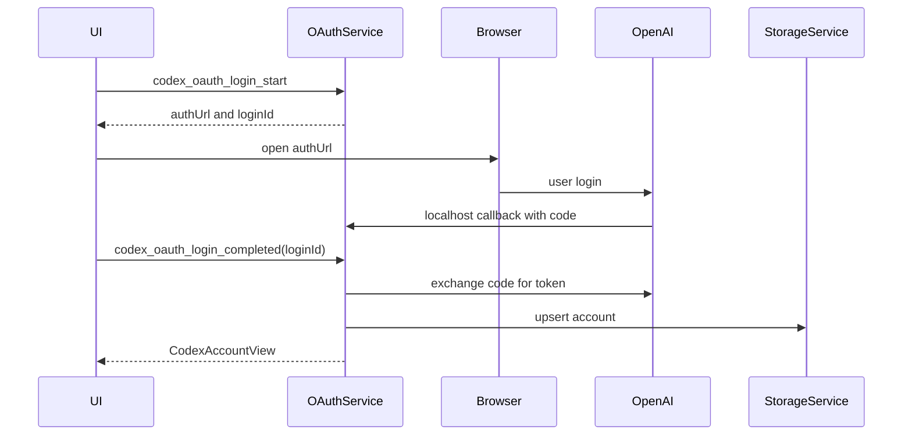
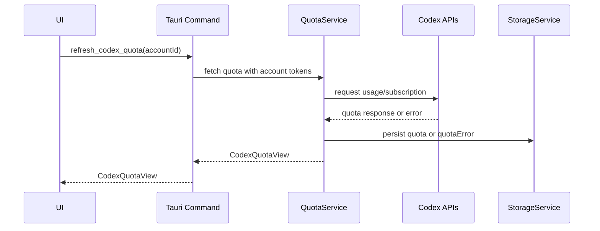

# 系统架构文档: Codex Lite

## 文档信息

- **功能名称**：Codex Lite
- **版本**：1.0
- **创建日期**：2026-06-11
- **作者**：Architect Agent

## 摘要

> 下游 Agent 请优先阅读本节，需要细节时再查阅完整文档。

- **架构模式**：轻量桌面单体应用。前端 React 负责界面和状态，Rust/Tauri 负责本机文件、OAuth、网络请求、账号切换和日志。
- **技术栈**：Tauri 2 + Rust + React + TypeScript + Vite + Zustand + CSS Modules 或 Tailwind CSS。
- **核心设计决策**：
  - 只做 Codex-only，不引入多平台抽象、CLIProxyAPI sidecar、广告公告系统。
  - 采用版本化本地 JSON 存储作为第一阶段数据层，减少 SQLite/迁移复杂度；公开发布前补数据 schema version 和迁移器。
  - Rust 后端集中处理敏感凭据、Codex auth 写入、OAuth、配额请求和日志，前端只拿脱敏后的展示数据。
- **主要风险**：Codex 本地 auth 文件结构和远端配额接口可能变化；OAuth 端口冲突；Token/API Key 安全存储；Windows 文件权限差异。
- **项目结构**：建议新建独立仓库，不在 Cockpit Tools 原仓库内删改；从原项目只参考 Codex 模型、OAuth、配额、原子写入和错误处理思路。

---

## 1. 技术调研

### 1.1 调研背景

**需求概述**：Codex Lite 是本地优先的 Codex 账号管理桌面工具，需要跨 macOS / Windows，后续支持 Linux；核心能力是导入多个 Codex 账号、展示配额、识别当前账号和一键切换。

**关键技术挑战**：

- 本地能力：需要安全读写 `~/.codex/auth.json`、打开文件选择器、写日志、构建安装包。
- 敏感凭据：OAuth Token、Refresh Token、API Key 必须避免泄露，日志需要脱敏。
- 外部接口不稳定：Codex auth 文件格式、OAuth 端点和配额接口可能变化。
- 跨平台差异：macOS / Windows / Linux 的路径、权限、安装包和系统安全策略不同。

### 1.2 技术方案对比

#### 桌面框架对比

| 方案 | 优点 | 缺点 | 适用场景 | 推荐度 |
| --- | --- | --- | --- | --- |
| Tauri 2 | 体积小，Rust 本机能力强，跨平台打包成熟，适合本地文件和系统集成 | Rust 学习成本高，部分插件需要平台适配 | 本地优先桌面工具 | 高 |
| Electron | 生态成熟，Node.js 本机生态丰富 | 包体大、资源占用高，与“轻量”目标冲突 | 重型桌面应用 | 中 |
| Native Swift/WinUI | 系统体验好 | 多平台成本高，团队维护压力大 | 单平台精品工具 | 低 |

**结论**：选择 Tauri 2。它和参考项目一致，能复用经验，又更符合轻量目标。

#### 前端框架对比

| 方案 | 优点 | 缺点 | 适用场景 | 推荐度 |
| --- | --- | --- | --- | --- |
| React + Vite | 生态成熟，参考项目已有大量模式，开发快 | 需要控制组件复杂度 | 桌面 SPA | 高 |
| SvelteKit | 代码量少，性能好 | 团队和参考项目复用度较低 | 新团队轻量 UI | 中 |
| Vue + Vite | 上手简单 | 与参考代码迁移成本更高 | 偏 Vue 团队 | 中 |

**结论**：选择 React + Vite + TypeScript。轻量不是换技术栈，而是减少产品和模块复杂度。

#### 状态管理对比

| 方案 | 优点 | 缺点 | 适用场景 | 推荐度 |
| --- | --- | --- | --- | --- |
| Zustand | 简单，适合少量全局状态，参考项目已使用 | 需要约束 store 粒度 | 账号列表、当前账号、刷新状态 | 高 |
| Redux Toolkit | 可维护性强 | 模板和概念较多 | 大型复杂状态 | 中 |
| React Context | 零依赖 | 异步状态和派生状态容易混乱 | 很小应用 | 中 |

**结论**：选择 Zustand。按功能划分 2-3 个 store，避免多平台时代的 store 膨胀。

#### 数据存储对比

| 方案 | 优点 | 缺点 | 适用场景 | 推荐度 |
| --- | --- | --- | --- | --- |
| 版本化 JSON 文件 | 零依赖，易调试，适合第一阶段 | 并发和查询能力弱，需要谨慎原子写入 | 小型本地账号索引 | 高 |
| SQLite | 查询强，事务好，迁移规范 | 引入 schema 和迁移成本 | 大量数据、复杂查询 | 中 |
| 系统钥匙串/凭据管理器 | 安全性更好 | 跨平台抽象成本较高 | 存储敏感 Token/API Key | 中高 |

**结论**：第一阶段账号索引用版本化 JSON；敏感字段默认仍可随账号文件存储，但必须日志脱敏、原子写入。公开发布前评估接入系统钥匙串/Windows Credential Manager/libsecret。

### 1.3 可参考开源/本地模块

| 来源 | 可参考内容 | 是否采用 | 说明 |
| --- | --- | --- | --- |
| Cockpit Tools `src-tauri/src/models/codex.rs` | Codex auth/account/quota 数据形态 | 部分采用 | 精简字段，去掉 API service、model provider、wakeup 相关字段。 |
| Cockpit Tools `codex_account.rs` | 本机导入、文件导入、切换、原子写入 | 部分采用 | 只抽取 Codex account 核心逻辑，避免带入多平台和托盘联动。 |
| Cockpit Tools `codex_oauth.rs` | OAuth PKCE、本地 callback server、pending state | 部分采用 | 保留登录流程，简化端口管理和 UI 事件。 |
| Cockpit Tools `codex_quota.rs` | wham usage / subscriptions 查询和错误分类 | 部分采用 | 保留配额查询，删除自动切换和告警逻辑。 |
| Cockpit Tools `cockpit-cliproxy` | Codex API relay | 不采用 | 第一版明确不做 API service / relay。 |

### 1.4 调研结论

| 层级 | 推荐方案 | 选择理由 | 备选方案 |
| --- | --- | --- | --- |
| 桌面框架 | Tauri 2 | 轻量、跨平台、本地能力强 | Electron |
| 前端 | React + TypeScript + Vite | 复用参考项目经验，开发效率高 | Svelte + Vite |
| 状态管理 | Zustand | 简单、够用、低样板 | React Query + Context |
| 后端 | Rust Tauri commands | 安全处理本机文件、OAuth、配额请求 | Node sidecar |
| 数据层 | 版本化 JSON 文件 | 第一阶段最轻，容易审计 | SQLite |
| 打包 | Tauri bundler + GitHub Actions | 与开源 release 流程匹配 | 手工打包 |

---

## 2. 架构概述

### 2.1 系统架构图



### 2.2 架构决策

| 决策 | 选项 | 选择 | 原因 |
| --- | --- | --- | --- |
| 项目形态 | 在原项目裁剪 / 新建独立项目 | 新建独立项目 | 避免被原多平台架构、广告和历史兼容拖累。 |
| 桌面技术 | Tauri / Electron / Native | Tauri | 轻量，Rust 适合本地敏感操作。 |
| 数据层 | JSON / SQLite / Keychain-only | JSON 起步 | 账号数量小，操作简单，先控制复杂度。 |
| API relay | 内置 / 不内置 | 不内置 | PRD 明确第一版不做 CLIProxyAPI。 |
| 平台抽象 | Codex-only / Provider plugin | Codex-only | 第一版只服务 Codex，减少抽象浪费。 |
| 凭据处理 | 前端处理 / Rust 处理 | Rust 处理 | 降低敏感数据暴露面。 |

### 2.3 分层设计

- **Presentation 层**：React 页面、组件、表单和错误展示。
- **State 层**：Zustand stores，管理账号列表、当前账号、导入流程、配额刷新状态。
- **Command Client 层**：TypeScript 封装 Tauri invoke，统一类型定义。
- **Application Service 层**：Rust service 编排导入、刷新、切换、OAuth。
- **Domain 层**：CodexAccount、CodexAuthFile、CodexQuota、ImportResult 等模型和校验。
- **Infrastructure 层**：文件系统、原子写入、HTTP client、OAuth callback server、日志、路径检测。

---

## 3. 技术栈

| 层级 | 技术 | 版本建议 | 说明 |
| --- | --- | --- | --- |
| 桌面框架 | Tauri | 2.x | 跨平台桌面壳和本机 command。 |
| 后端语言 | Rust | 2021 edition | 本机文件、OAuth、HTTP、日志。 |
| 前端框架 | React | 19.x 或稳定 18/19 | 桌面 SPA。 |
| 构建工具 | Vite | 7.x | 快速开发和构建。 |
| 类型系统 | TypeScript | 5.x | 前端严格类型。 |
| 状态管理 | Zustand | 5.x | 轻量全局状态。 |
| 样式 | Tailwind CSS 或 CSS Modules | Tailwind 3/4 | 第一阶段建议选择一种，不混用过多 UI 体系。 |
| 图标 | lucide-react | 最新稳定 | 简洁工具型图标。 |
| HTTP | reqwest | 0.12+ | Rust 侧请求 OAuth / quota。 |
| 序列化 | serde / serde_json | 1.x | 本地 JSON 和 Tauri payload。 |
| 日志 | tracing | 0.1 | 结构化日志和脱敏。 |
| 打包 | Tauri bundler | 2.x | macOS / Windows / Linux release。 |

---

## 4. 目录结构

建议新建独立仓库，目录如下：

```text
codex-lite/
├── package.json
├── vite.config.ts
├── tsconfig.json
├── src/
│   ├── main.tsx
│   ├── App.tsx
│   ├── components/
│   │   ├── account/
│   │   ├── import/
│   │   ├── layout/
│   │   └── ui/
│   ├── pages/
│   │   ├── AccountsPage.tsx
│   │   ├── ImportPage.tsx
│   │   ├── SettingsPage.tsx
│   │   └── LogsPage.tsx
│   ├── services/
│   │   ├── codexAccountService.ts
│   │   ├── codexImportService.ts
│   │   ├── codexOAuthService.ts
│   │   └── systemService.ts
│   ├── stores/
│   │   ├── useCodexAccountsStore.ts
│   │   ├── useImportFlowStore.ts
│   │   └── useSettingsStore.ts
│   ├── types/
│   │   ├── codex.ts
│   │   ├── import.ts
│   │   └── system.ts
│   ├── utils/
│   └── styles/
├── src-tauri/
│   ├── Cargo.toml
│   ├── tauri.conf.json
│   └── src/
│       ├── main.rs
│       ├── lib.rs
│       ├── commands/
│       │   ├── account.rs
│       │   ├── import.rs
│       │   ├── oauth.rs
│       │   ├── quota.rs
│       │   ├── settings.rs
│       │   └── system.rs
│       ├── models/
│       │   ├── account.rs
│       │   ├── auth.rs
│       │   ├── import.rs
│       │   ├── quota.rs
│       │   └── settings.rs
│       ├── services/
│       │   ├── account_service.rs
│       │   ├── auth_file_service.rs
│       │   ├── import_service.rs
│       │   ├── oauth_service.rs
│       │   ├── quota_service.rs
│       │   ├── switch_service.rs
│       │   └── settings_service.rs
│       └── infra/
│           ├── atomic_write.rs
│           ├── paths.rs
│           ├── redaction.rs
│           ├── storage.rs
│           └── logger.rs
├── docs/
│   ├── privacy.md
│   └── troubleshooting.md
└── .github/
    └── workflows/
        └── release.yml
```

### 4.1 从原项目参考但不迁移的目录

- 不迁移 `sidecars/`。
- 不迁移公告、赞助、广告、WebDAV、wakeup、多平台 instance、floating card。
- 不迁移多平台 layout store 和复杂 sidebar。
- 可人工参考 `src-tauri/src/modules/codex_*`，但落地时应重新拆分为更小的 Codex-only service。

---

## 5. 数据模型

### 5.1 实体关系图



### 5.2 本地文件布局

默认数据目录：

- macOS: `~/Library/Application Support/com.codex-lite.app/`
- Windows: `%APPDATA%/codex-lite/`
- Linux: `~/.local/share/codex-lite/`

建议文件：

```text
data/
├── accounts.json
├── settings.json
├── pending-oauth.json
├── backups/
│   └── codex-auth-before-switch-*.json
└── logs/
    └── codex-lite.log
```

### 5.3 数据字典

#### `accounts.json`

| 字段 | 类型 | 必填 | 说明 |
| --- | --- | --- | --- |
| schemaVersion | string | 是 | 数据结构版本，例如 `1.0.0`。 |
| currentAccountId | string? | 否 | 应用识别到或最近切换的账号 ID。 |
| accounts | CodexAccount[] | 是 | 已导入账号列表。 |
| updatedAt | number | 是 | Unix timestamp seconds。 |

#### `CodexAccount`

| 字段 | 类型 | 必填 | 说明 |
| --- | --- | --- | --- |
| id | string | 是 | 稳定账号 ID，优先由 user/account/email/token 指纹派生。 |
| displayName | string | 是 | 展示名称。 |
| email | string? | 否 | 账号邮箱，可能缺失。 |
| authMode | `oauth` / `api_key` | 是 | 认证类型。 |
| accountId | string? | 否 | Codex / OpenAI account id。 |
| userId | string? | 否 | 从 ID token 解析出的用户 ID。 |
| planType | string? | 否 | 订阅计划。 |
| tokenBundle | TokenBundle? | 否 | OAuth token，前端不直接展示。 |
| apiKey | string? | 否 | API Key，前端不直接展示。 |
| apiBaseUrl | string? | 否 | API Key 模式的 base URL。 |
| quota | CodexQuota? | 否 | 最近一次配额结果。 |
| quotaError | AppError? | 否 | 最近一次配额错误。 |
| tags | string[] | 是 | 标签。 |
| note | string? | 否 | 备注。 |
| createdAt | number | 是 | 创建时间。 |
| updatedAt | number | 是 | 更新时间。 |
| lastUsedAt | number? | 否 | 最近切换时间。 |

#### `settings.json`

| 字段 | 类型 | 必填 | 说明 |
| --- | --- | --- | --- |
| schemaVersion | string | 是 | 设置结构版本。 |
| codexHomePath | string? | 否 | 默认 `~/.codex`。 |
| authFilePath | string? | 否 | 默认 `~/.codex/auth.json`。 |
| theme | `system` / `light` / `dark` | 是 | 主题。 |
| language | string | 是 | 第一阶段建议 `zh-CN`，公开前可扩展。 |
| quotaRefreshOnStart | boolean | 是 | 启动时是否自动刷新。 |

---

## 6. Tauri Command 设计

Codex Lite 不需要 HTTP API；前端通过 Tauri invoke 调用 Rust command。命令必须返回结构化结果，错误统一返回 `AppError`。

### 6.1 账号命令

| Command | 入参 | 返回 | 说明 |
| --- | --- | --- | --- |
| `list_codex_accounts` | - | `CodexAccountView[]` | 返回脱敏账号列表。 |
| `get_current_codex_account` | - | `CodexAccountView?` | 读取本机 auth 并匹配账号。 |
| `delete_codex_account` | `accountId` | `void` | 删除账号。 |
| `update_codex_account_profile` | `accountId`, `displayName`, `tags`, `note` | `CodexAccountView` | 更新展示信息。 |
| `switch_codex_account` | `accountId` | `SwitchResult` | 写入本机 auth，成功后更新 current。 |

### 6.2 导入命令

| Command | 入参 | 返回 | 说明 |
| --- | --- | --- | --- |
| `import_codex_from_local` | - | `CodexAccountView` | 从当前本机 auth 导入。 |
| `import_codex_from_json` | `jsonContent` | `ImportResult` | 从 JSON 文本导入。 |
| `import_codex_from_files` | `filePaths` | `ImportResult` | 从多个文件导入。 |
| `start_codex_batch_import_from_files` | `filePaths`, `checkQuota` | `BatchImportSession` | 批量预检。 |
| `confirm_codex_batch_import` | `sessionId`, `itemIds` | `ImportResult` | 确认导入。 |
| `add_codex_account_with_token` | `idToken`, `accessToken`, `refreshToken?` | `CodexAccountView` | 手动 Token 导入。 |
| `add_codex_account_with_api_key` | `apiKey`, `apiBaseUrl?`, `displayName?` | `CodexAccountView` | API Key 导入。 |

### 6.3 OAuth 命令

| Command | 入参 | 返回 | 说明 |
| --- | --- | --- | --- |
| `codex_oauth_login_start` | - | `OAuthStartResult` | 生成 PKCE 和登录 URL。 |
| `codex_oauth_submit_callback_url` | `loginId`, `callbackUrl` | `void` | 手动提交回调。 |
| `codex_oauth_login_completed` | `loginId` | `CodexAccountView` | 换取 token 并导入账号。 |
| `codex_oauth_login_cancel` | `loginId?` | `void` | 取消 pending OAuth。 |
| `is_codex_oauth_port_in_use` | - | `boolean` | 检查本地回调端口。 |

### 6.4 配额和系统命令

| Command | 入参 | 返回 | 说明 |
| --- | --- | --- | --- |
| `refresh_codex_quota` | `accountId` | `CodexQuotaView` | 刷新单账号配额。 |
| `refresh_all_codex_quotas` | - | `RefreshAllResult` | 刷新全部账号。 |
| `get_settings` | - | `AppSettings` | 获取设置。 |
| `save_settings` | `settings` | `AppSettings` | 保存设置。 |
| `detect_codex_paths` | - | `CodexPathDetection` | 检测 `~/.codex`。 |
| `open_data_dir` | - | `void` | 打开数据目录。 |
| `open_log_dir` | - | `void` | 打开日志目录。 |
| `get_log_snapshot` | `maxLines` | `LogSnapshot` | UI 查看日志摘要。 |

### 6.5 错误模型

```rust
pub struct AppError {
    pub code: String,
    pub message: String,
    pub action: String,
    pub details: Option<serde_json::Value>,
    pub retryable: bool,
}
```

错误 code 建议：

- `CODEX_AUTH_NOT_FOUND`
- `CODEX_AUTH_READ_FAILED`
- `CODEX_AUTH_WRITE_FAILED`
- `CODEX_AUTH_INVALID_FORMAT`
- `CODEX_ACCOUNT_DUPLICATE`
- `CODEX_OAUTH_PORT_IN_USE`
- `CODEX_OAUTH_TIMEOUT`
- `CODEX_TOKEN_INVALID`
- `CODEX_QUOTA_UNAUTHORIZED`
- `CODEX_QUOTA_RATE_LIMITED`
- `CODEX_QUOTA_NETWORK_FAILED`
- `STORAGE_MIGRATION_FAILED`

---

## 7. 核心流程

### 7.1 本机导入流程



### 7.2 一键切换流程



### 7.3 OAuth 导入流程



### 7.4 配额刷新流程



---

## 8. 安全设计

### 8.1 敏感数据边界

- 前端默认只接收 `CodexAccountView`，不得包含完整 `accessToken`、`refreshToken`、`idToken`、`apiKey`。
- Rust service 负责解析、刷新、写入和持久化敏感字段。
- 日志必须经过 redaction，隐藏 token、key、authorization header、callback code。
- 导出账号时必须明确提示包含敏感凭据。

### 8.2 本地存储策略

第一阶段：

- 使用应用数据目录内的 JSON 文件存储账号。
- 写入使用临时文件 + fsync + rename 的原子写入策略。
- 切换本机 Codex auth 前创建 backup。
- 日志只记录账号 ID、邮箱脱敏值、错误 code、HTTP status，不记录完整 token。

公开发布前评估：

- macOS Keychain。
- Windows Credential Manager。
- Linux Secret Service/libsecret。
- 或基于系统密钥的本地加密文件。

### 8.3 OAuth 安全

- 使用 PKCE。
- callback server 只监听 `127.0.0.1`。
- state 必须校验。
- pending state 有过期时间。
- OAuth 取消或超时不写入账号。

### 8.4 文件写入安全

- 写入 `~/.codex/auth.json` 前校验目标账号是否具备可投影的 auth 信息。
- 写入前备份原文件到应用数据目录。
- 写入失败时保留原文件；如果中途失败，尝试回滚备份。
- 不提供静默 fallback；失败必须返回明确错误。

---

## 9. 部署与发布架构

### 9.1 开发环境

| 环境 | 命令 | 说明 |
| --- | --- | --- |
| 前端开发 | `pnpm dev` | Vite web 调试。 |
| 桌面开发 | `pnpm tauri:dev` | Tauri 桌面调试。 |
| 类型检查 | `pnpm typecheck` | TypeScript 检查。 |
| Rust 检查 | `cargo check` | Rust 编译检查。 |

### 9.2 构建产物

第一阶段：

- macOS: `.dmg` / `.app`
- Windows: `.msi` 或 `.exe`

公开发布前：

- Linux: `.deb` / `.rpm` / `.AppImage`
- GitHub Release artifacts
- checksums
- README 安装说明

### 9.3 CI/CD

建议 GitHub Actions：

- PR: `pnpm install --frozen-lockfile`, `pnpm typecheck`, `cargo check`, `cargo test`。
- Release: matrix 构建 macOS / Windows / Linux 安装包。
- 暂不做自动更新服务；公开发布后再决定是否启用 Tauri updater。

---

## 10. 性能考虑

| 指标 | 目标值 | 说明 |
| --- | --- | --- |
| 应用冷启动 | 2 秒内出现主界面骨架 | 不在启动阻塞刷新全部配额。 |
| 账号列表容量 | 100 个账号流畅展示 | 超过后可考虑虚拟列表。 |
| 本地切换 | 1 秒内完成 | 不包含主动网络验证。 |
| 配额刷新 | 单账号 10 秒超时 | 失败保留旧值并标记过期。 |

优化策略：

- 启动时先加载本地账号，再异步检测当前账号。
- 配额刷新手动触发为主，避免启动时大量网络请求。
- 批量导入采用 session + preview，避免 UI 长时间阻塞。
- 前端页面按导入弹窗/日志页懒加载。

---

## 11. 技术风险

| 风险 | 可能性 | 影响 | 缓解措施 |
| --- | --- | --- | --- |
| Codex auth 文件结构变化 | 中 | 高 | 独立 AuthFileService，严格 schema 校验，错误提示包含字段问题。 |
| 配额接口变化 | 中 | 中 | QuotaService 隔离远端协议，保留 raw snapshot 供排查。 |
| OAuth 端口冲突 | 中 | 中 | 检测端口占用，提供手动提交 callback URL。 |
| Token/API Key 泄露 | 低 | 高 | 前端脱敏视图、日志 redaction、导出二次确认。 |
| JSON 文件损坏 | 中 | 中 | 原子写入、启动校验、保留最近备份。 |
| Windows 权限/路径差异 | 中 | 中 | PathDetection 抽象，Windows smoke test。 |
| 第一阶段导入方式过多 | 中 | 中 | 分批实现：本机/文件 -> Token/API Key -> OAuth -> 批量 preview。 |

---

## 12. 架构边界

### 12.1 第一阶段必须坚持的边界

- 不引入多平台 provider 抽象。
- 不引入 sidecar。
- 不引入广告、公告、赞助模块。
- 不做复杂多开实例。
- 不在前端保存或展示完整敏感凭据。
- 不为了未来可能需求提前设计插件系统。

### 12.2 可以预留但不实现的边界

- `schemaVersion` 和迁移器接口。
- `AuthSecretStore` trait，用于后续替换 JSON 内敏感字段存储。
- `QuotaProvider` 内部 trait，用于远端接口变化时局部替换。
- `PlatformPaths` 内部模块，用于公开前补 Linux。

---

## 变更记录

| 版本 | 日期 | 作者 | 变更内容 |
| --- | --- | --- | --- |
| 1.0 | 2026-06-11 | Architect Agent | 初始架构设计 |

[BOSS_STATUS]
status: DONE_WITH_CONCERNS
summary: 已完成 Codex Lite 架构设计，确定 Tauri + Rust + React 轻量桌面单体架构、本地 JSON 数据层、Tauri command 接口和安全边界。
concerns: 需要在实现前用真实 Codex auth 样本验证 auth/config 结构、配额接口、OAuth 回调和 API Key 模式语义；公开发布前应重新评估系统钥匙串存储。
[/BOSS_STATUS]
