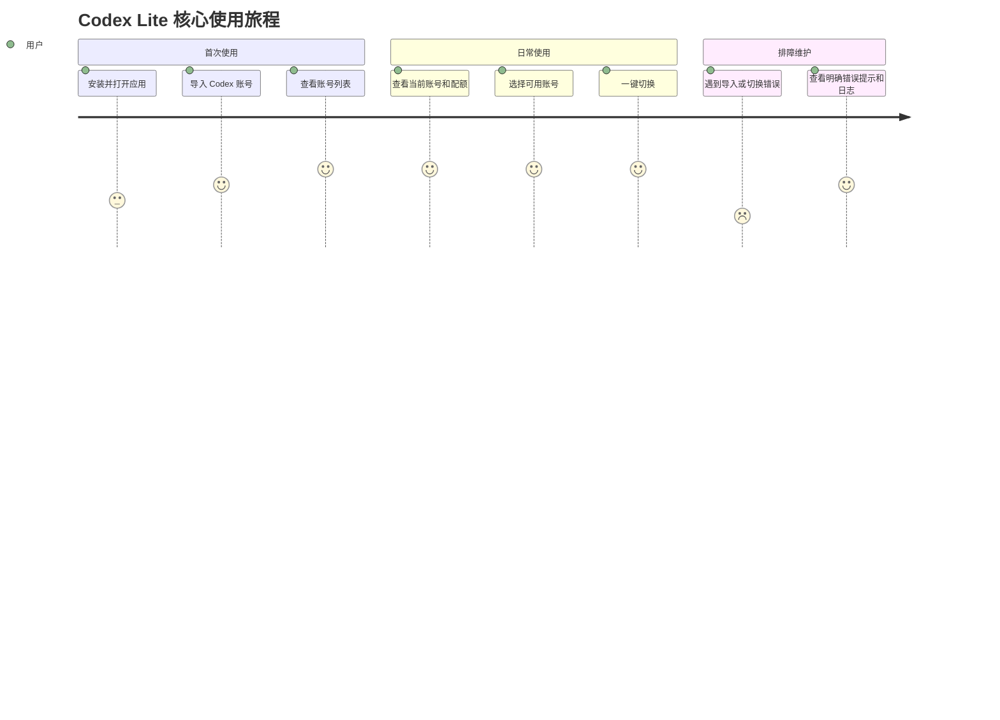

# 产品需求文档 (PRD): Codex Lite

## 文档信息

- **功能名称**：Codex Lite
- **版本**：1.0
- **创建日期**：2026-06-11
- **作者**：PM Agent
- **状态**：草稿

## 摘要

> 下游 Agent 请优先阅读本节，需要细节时再查阅完整文档。

- **核心目标**：做一个本地优先、无广告、只聚焦 Codex 的轻量账号管理工具。
- **目标用户**：需要管理多个 Codex 账号的个人开发者、小团队成员和重度 Codex CLI 用户。
- **关键功能**：Codex 账号导入、账号列表管理、当前账号识别、配额查看、一键切换。
- **技术约束**：第一阶段支持 macOS / Windows；公开发布前补齐 Linux、README、release 包、错误恢复和迁移机制。
- **优先级**：优先完成 Codex 核心闭环，不做多平台矩阵、广告、复杂代理服务和非核心展示功能。

---

## 1. 概述

### 1.1 背景

参考项目 Cockpit Tools 已经覆盖大量 AI IDE 平台，并包含赞助、公告、代理服务、悬浮窗、多语言、WebDAV、托盘布局等扩展能力。对只想管理 Codex 账号的用户来说，现有产品过重，核心路径被过多非必要功能稀释。

Codex Lite 的目标不是复制完整 Cockpit Tools，而是提炼 Codex 账号管理的核心价值：导入账号、查看状态、切换账号。产品应保持干净、直接、稳定，减少用户在广告、平台选择和复杂设置中的认知负担。

### 1.2 目标

- 提供一个只面向 Codex 的本地桌面账号管理工具。
- 让用户能可靠导入多个 Codex 账号并查看配额。
- 让用户能一键切换本机当前 Codex 账号。
- 第一阶段满足小圈子 macOS / Windows 用户稳定使用。
- 公开发布前达到 GitHub 免费开源项目的基础质量。

### 1.3 成功指标

- [ ] 用户可在 macOS / Windows 安装并启动应用。
- [ ] 用户可通过本机导入、文件导入、OAuth、Token/API Key 至少一种方式成功添加 Codex 账号。
- [ ] 用户可看到当前 Codex 账号、账号列表和配额状态。
- [ ] 用户可一键切换账号，并使本机 Codex 使用目标账号。
- [ ] 常见失败场景有明确错误提示和可定位日志。
- [ ] 公开发布前提供 Linux 支持、README、release 包、迁移和错误恢复方案。

---

## 2. 需求穿透分析

### 2.1 用户原始需求

> 我想根据他，做一个仿品，他现在这个太重了，而且有很多广告。

### 2.2 需求分层

**显性需求**

| 需求 | 用户原话 | 解读 |
| --- | --- | --- |
| 做一个参考 Cockpit Tools 的仿品 | “根据他，做一个仿品” | 复用成熟产品的核心模式，但不要求完整复刻。 |
| 降低产品重量 | “太重了” | 删除多平台、代理、公告、赞助、复杂同步等非 Codex 必需功能。 |
| 去广告 | “很多广告” | 不做赞助位、推广页、营销公告和商业导流。 |
| 第一版只做 Codex | 用户选择 A | 产品定位为 Codex-only。 |

**隐性需求**

| 需求 | 推断依据 | 为什么重要 |
| --- | --- | --- |
| 核心功能要可靠，而不是极简到不可用 | 用户选择导入能力 D | 用户愿意砍平台和广告，但不想砍 Codex 核心能力。 |
| 用户需要低学习成本 | 原项目过重带来负担 | Codex Lite 应该打开即懂，核心任务路径短。 |
| 用户希望后续可公开维护 | 用户说明会发布 GitHub | 架构、文档、构建和错误处理不能只按个人脚本标准设计。 |

**潜在需求**

| 需求 | 洞察来源 | 预期价值 |
| --- | --- | --- |
| 数据迁移与兼容 | 公开发布后版本迭代不可避免 | 避免用户升级后账号丢失或配置损坏。 |
| 故障诊断能力 | OAuth、配额接口、本地文件权限都可能失败 | 降低维护成本，方便 GitHub issue 排查。 |
| 安全存储策略 | Codex token / API Key 属于敏感信息 | 开源发布时必须建立用户信任。 |

**惊喜需求**

| 需求 | 创新点 | 预期反应 |
| --- | --- | --- |
| 切换前健康检查 | 切号前检查目标账号凭据、配额和本地路径状态 | 用户感觉工具“靠谱，不会乱写配置”。 |
| 配额状态轻提示 | 在账号列表直接展示可用性、重置时间和异常状态 | 用户不用进入详情页也能决定切哪个账号。 |
| 配置写入可回滚 | 切号前保存上一份本地 auth 状态，失败时恢复 | 用户敢放心使用一键切换。 |

### 2.3 需求优先级矩阵

| 优先级 | 需求 | 价值 | 成本 | 决策 |
| --- | --- | --- | --- | --- |
| P0 | Codex 账号导入 | 高 | 中 | 必须做 |
| P0 | 当前账号识别 | 高 | 低 | 必须做 |
| P0 | 配额展示 | 高 | 中 | 必须做 |
| P0 | 一键切换 | 高 | 中 | 必须做 |
| P0 | 错误提示和基础日志 | 高 | 低 | 必须做 |
| P1 | OAuth / Token / API Key / 批量文件完整导入 | 高 | 高 | 第一阶段做 |
| P1 | macOS / Windows 安装包 | 高 | 中 | 第一阶段做 |
| P1 | 切换前健康检查和失败回滚 | 高 | 中 | 优先做 |
| P2 | Linux 支持 | 中 | 中 | 公开前做 |
| P2 | 完整 README 与 release 流程 | 中 | 低 | 公开前做 |
| P3 | 多平台账号管理 | 低 | 高 | 暂不做 |
| P3 | CLIProxyAPI / API relay | 中 | 高 | 暂不做 |

---

## 3. 目标用户

### 用户画像 1：多账号 Codex 用户

| 属性 | 描述 |
| --- | --- |
| 角色 | 个人开发者、小团队成员、AI 编程工具重度用户 |
| 特征 | 有多个 Codex 账号，关注配额、可用性和切换效率 |
| 需求 | 快速知道哪个账号可用，并把本机 Codex 切到目标账号 |
| 痛点 | 手动管理 `~/.codex/auth.json` 容易出错；大型工具功能太多、广告干扰大 |
| 期望 | 打开工具即可看到账号状态，点击一次完成切换 |

### 用户旅程图

---

## 4. 功能需求

### FR-001：Codex 账号列表管理

- **描述**：系统应提供 Codex 账号列表，展示账号名称、邮箱或标识、账号类型、配额摘要、当前账号标记和异常状态。
- **优先级**：P0
- **需求来源**：显性需求
- **验收标准**：
  - [ ] AC-1：用户可以查看所有已导入 Codex 账号。
  - [ ] AC-2：当前本机 Codex 账号在列表中有明确标记。
  - [ ] AC-3：账号可删除、重命名，并可填写备注或标签。
  - [ ] AC-4：账号为空时展示可操作的空状态，而不是空白页面。
- **边界情况**：
  - 账号索引文件损坏时，应提示修复或重新导入。
  - 账号缺少邮箱时，应使用稳定 ID 或用户自定义名称展示。

### FR-002：Codex 账号导入

- **描述**：系统应支持从本机 `~/.codex/auth.json`、JSON / 文件、批量文件、OAuth、Refresh Token / Token 和 API Key 导入 Codex 账号。
- **优先级**：P0
- **需求来源**：显性需求
- **验收标准**：
  - [ ] AC-1：用户可以从本机当前 Codex 登录状态导入账号。
  - [ ] AC-2：用户可以选择 JSON 或 auth 文件导入账号。
  - [ ] AC-3：用户可以批量导入多个账号文件，并看到成功、跳过、失败数量。
  - [ ] AC-4：用户可以通过 OAuth 流程新增账号。
  - [ ] AC-5：用户可以通过 Token / API Key 新增账号。
  - [ ] AC-6：重复账号导入时不产生不可识别的重复记录。
- **边界情况**：
  - 文件格式不合法时，应显示具体原因。
  - OAuth 被用户取消时，应保持现有账号不变。
  - Token 无法验证时，应提示验证失败并保留用户输入恢复入口。

### FR-003：当前账号识别

- **描述**：系统应读取本机 Codex 当前认证状态，识别当前账号，并与已导入账号列表匹配。
- **优先级**：P0
- **需求来源**：显性需求
- **验收标准**：
  - [ ] AC-1：应用启动后可展示当前 Codex 账号。
  - [ ] AC-2：当前账号未被导入时，应提示用户可导入当前账号。
  - [ ] AC-3：无法读取本机 auth 文件时，应展示路径和权限相关错误。

### FR-004：Codex 配额展示与刷新

- **描述**：系统应展示 Codex 账号计划信息、Hourly / Weekly 配额、重置时间、刷新状态和错误信息。
- **优先级**：P0
- **需求来源**：显性需求
- **验收标准**：
  - [ ] AC-1：用户可以手动刷新单个账号配额。
  - [ ] AC-2：用户可以手动刷新全部账号配额。
  - [ ] AC-3：刷新失败时保留上一次成功结果，并标记数据过期。
  - [ ] AC-4：配额数据应在列表和账号详情中都可被理解。
- **边界情况**：
  - 网络失败、401、429、服务端异常应有不同错误提示。
  - 未支持的账号类型应显示“不支持配额查询”，而不是报错崩溃。

### FR-005：一键切换 Codex 当前账号

- **描述**：系统应允许用户选择一个已导入账号，并将其写入本机 Codex 当前认证配置，使本机 Codex 使用该账号。
- **优先级**：P0
- **需求来源**：显性需求
- **验收标准**：
  - [ ] AC-1：用户点击切换后，本机 Codex 当前账号变为目标账号。
  - [ ] AC-2：切换前执行路径和凭据健康检查。
  - [ ] AC-3：切换失败时不破坏原本可用的本机 auth 状态。
  - [ ] AC-4：切换成功后列表当前账号标记立即更新。
- **边界情况**：
  - 目标账号凭据缺失或过期时，应阻止切换并提示用户重新导入或刷新。
  - auth 文件无写入权限时，应提示具体路径和权限建议。

### FR-006：基础设置

- **描述**：系统应提供必要设置项，包括 Codex 配置路径检测、数据目录打开、日志目录打开和基础主题设置。
- **优先级**：P1
- **需求来源**：隐性需求
- **验收标准**：
  - [ ] AC-1：用户可查看并重设 Codex auth/config 路径。
  - [ ] AC-2：用户可打开应用数据目录和日志目录。
  - [ ] AC-3：路径检测失败时有明确提示。

### FR-007：错误提示与日志

- **描述**：系统应为导入、刷新配额、OAuth、切换账号等关键动作记录基础日志，并在 UI 中展示面向用户的错误信息。
- **优先级**：P0
- **需求来源**：潜在需求
- **验收标准**：
  - [ ] AC-1：关键失败事件写入日志。
  - [ ] AC-2：错误提示包含操作、原因和下一步建议。
  - [ ] AC-3：用户可从设置页打开日志目录。

### FR-008：公开发布准备

- **描述**：公开发布前应补齐 Linux 支持、README、release 包、数据迁移和更完整错误恢复。
- **优先级**：P2
- **需求来源**：显性需求
- **验收标准**：
  - [ ] AC-1：macOS / Windows / Linux 均可构建 release 包。
  - [ ] AC-2：README 覆盖安装、导入、切换、配额刷新、常见问题和隐私说明。
  - [ ] AC-3：数据结构版本化，支持后续迁移。

---

## 5. 非功能需求

### NFR-001：性能

- 应用冷启动后 2 秒内展示主界面骨架。
- 账号列表在 100 个账号内保持流畅滚动和筛选。
- 切换账号的本地文件写入应在 1 秒内完成，不包含网络验证时间。

### NFR-002：可靠性

- 所有写入本机 Codex auth/config 的操作必须采用原子写入或可恢复策略。
- 切换账号前应备份当前状态，失败时尽量恢复。
- 应避免静默失败；关键失败必须有 UI 提示和日志。

### NFR-003：安全与隐私

- 账号凭据、Token、API Key 不得上传到非用户明确配置的远端服务。
- 默认所有账号数据保存在本机。
- 日志不得明文记录完整 Token、API Key 或 Refresh Token。
- 公开发布 README 必须说明本地数据位置和联网场景。

### NFR-004：体验

- 主界面不出现广告、赞助、营销公告或外部推广入口。
- 核心路径“导入账号 -> 查看配额 -> 切换账号”不超过 3 次主要点击。
- 错误信息应面向用户可理解，避免只显示底层异常栈。

### NFR-005：兼容性

- 第一阶段支持 macOS / Windows。
- 公开发布前支持 Linux。
- 应兼容 Codex 官方本地认证文件的常见位置和结构变化，并在不兼容时明确提示。

---

## 6. 用户故事

### US-001：导入当前 Codex 账号

- **作为** 多账号 Codex 用户
- **我想要** 从本机当前 Codex 登录状态导入账号
- **以便** 不需要手工复制 auth 文件就能开始管理
- **验收标准**：
  - [ ] 可以读取 `~/.codex/auth.json`。
  - [ ] 导入成功后账号出现在列表。
  - [ ] 已存在账号不会重复创建不可区分记录。
- **优先级**：P0

### US-002：查看配额

- **作为** Codex 重度用户
- **我想要** 查看每个账号的 Hourly / Weekly 配额和重置时间
- **以便** 决定当前应该切换到哪个账号
- **验收标准**：
  - [ ] 列表直接展示配额摘要。
  - [ ] 详情或展开区域展示更完整信息。
  - [ ] 刷新失败时有明确原因。
- **优先级**：P0

### US-003：一键切换账号

- **作为** 多账号用户
- **我想要** 点击一个按钮切换当前 Codex 账号
- **以便** 不再手工替换本地 auth 文件
- **验收标准**：
  - [ ] 切换成功后当前账号标记更新。
  - [ ] 本机 Codex 使用目标账号。
  - [ ] 切换失败时原配置不被破坏。
- **优先级**：P0

### US-004：排查失败

- **作为** 小圈子测试用户
- **我想要** 在导入、刷新、切换失败时看到原因和日志
- **以便** 能自己处理常见问题或给维护者提交有效反馈
- **验收标准**：
  - [ ] UI 错误提示包含下一步建议。
  - [ ] 设置页可打开日志目录。
  - [ ] 日志不泄露完整敏感凭据。
- **优先级**：P0

---

## 7. 范围定义

### 7.1 范围内

- Codex-only 桌面应用。
- 账号导入、列表、删除、重命名、备注或标签。
- 当前账号识别。
- 配额刷新与展示。
- 一键切换当前 Codex 账号。
- 基础设置、日志和错误提示。
- macOS / Windows 第一阶段安装包。
- 公开发布前补 Linux、README、release 包、迁移机制。

### 7.2 范围外

- 多平台账号管理：会显著增加 UI、配置、导入、切换和配额接口复杂度。
- 广告、赞助、推广和公告营销：违背“干净无广告”的核心定位。
- CLIProxyAPI / API relay：属于另一个复杂产品方向，第一版不做。
- 复杂多开实例：第一版聚焦账号切换，不做实例生命周期管理。
- WebDAV、云同步、复杂自动备份：增加安全和维护成本。
- 18 种语言国际化：第一阶段可先中英文或中文为主，公开后按需扩展。
- 悬浮窗、彩蛋、烟花动效：不服务核心场景。

---

## 8. 风险与依赖

### 8.1 风险

| 风险 | 可能性 | 影响 | 缓解措施 |
| --- | --- | --- | --- |
| Codex 本地认证文件结构变化 | 中 | 高 | 将 auth 读写封装成独立模块，增加格式校验和错误提示。 |
| OAuth 流程不稳定或平台限制变化 | 中 | 高 | 将 OAuth 作为独立导入路径，失败不影响本机/文件导入。 |
| 配额接口变化或限流 | 中 | 中 | 缓存上次成功结果，区分 401/429/网络错误。 |
| Token/API Key 敏感信息泄露 | 低 | 高 | 日志脱敏，本地存储策略明确，避免远端上传。 |
| 第一版导入方式过多导致延期 | 中 | 中 | 先打通本机/文件/Token，再接 OAuth 和批量导入。 |
| Windows 文件权限和路径差异 | 中 | 中 | 早期纳入 Windows smoke test，错误提示包含路径。 |

### 8.2 依赖

| 依赖项 | 类型 | 状态 | 负责人 |
| --- | --- | --- | --- |
| Codex 本地 auth/config 文件格式 | 外部 | 待验证 | Backend |
| Codex 配额查询接口 | 外部 | 待验证 | Backend |
| OAuth 登录流程 | 外部 | 待验证 | Backend |
| 跨平台打包工具链 | 技术 | 待设计 | DevOps |
| 本地安全存储方案 | 技术 | 待设计 | Architect |

---

## 9. 里程碑

| 里程碑 | 内容 | 目标日期 |
| --- | --- | --- |
| M0 需求确认 | design-brief 和 PRD 完成 | - |
| M1 架构与 UI | 技术方案、数据模型、主界面设计完成 | - |
| M2 核心闭环 | 本机/文件导入、账号列表、当前账号、一键切换 | - |
| M3 完整导入 | OAuth、Token/API Key、批量导入、配额刷新 | - |
| M4 小圈子试用 | macOS / Windows 安装包、日志、错误提示 | - |
| M5 公开发布准备 | Linux、README、release、迁移机制 | - |

---

## 10. 开放问题

- [ ] 第一版 UI 文案默认中文，还是中英文都做？
- [ ] 是否新建独立仓库，还是先在当前仓库外维护一个轻量分支/目录？
- [ ] 本地敏感凭据是否需要系统钥匙串/凭据管理器，还是第一阶段使用本地加密文件？
- [ ] API Key 账号与 OAuth 账号在配额展示和切换语义上是否完全统一？

---

## 变更记录

| 版本 | 日期 | 作者 | 变更内容 |
| --- | --- | --- | --- |
| 1.0 | 2026-06-11 | PM Agent | 初始 PRD |

[BOSS_STATUS]
status: DONE_WITH_CONCERNS
summary: 已基于设计简报完成 Codex Lite PRD，覆盖需求穿透、功能需求、验收标准、范围、风险和里程碑。
concerns: 仍需在架构阶段验证 Codex auth/config 文件结构、OAuth 流程、配额接口和本地敏感凭据存储方案。
[/BOSS_STATUS]
