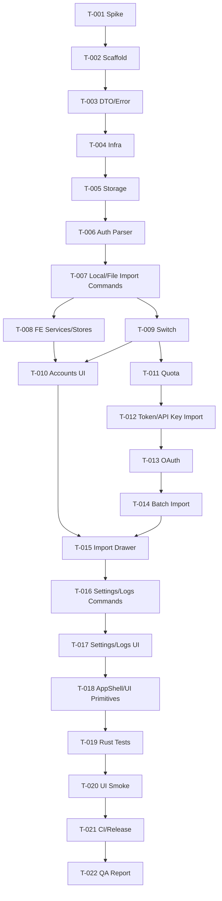

# 开发任务规格文档: Codex Lite

## 文档信息

- **功能名称**：Codex Lite
- **版本**：1.0
- **创建日期**：2026-06-11
- **作者**：Scrum Master Agent
- **关联故事**：`.boss/codex-lite/prd.md`

## 摘要

> 下游 Agent 请优先阅读本节，需要细节时再查阅完整文档。

- **任务总数**：22 个
- **前端任务**：7 个
- **后端任务**：10 个
- **共享/DevOps/QA 任务**：5 个
- **关键路径**：T-001 -> T-002 -> T-004 -> T-005 -> T-006 -> T-009 -> T-010 -> T-012 -> T-014 -> T-020
- **预估复杂度**：高
- **Blast Radius**：高
- **风险确认触发项**：需确认。原因：新建独立 Tauri 项目会写入超过 10 个文件；会创建/修改 `package.json`、锁文件、`Cargo.toml`、Tauri 配置；涉及认证、本地敏感凭据、数据模型和文件写入。

---

## 0. Repo Preflight 摘要

| 事实 | 发现结果 | 证据命令/文件 |
| --- | --- | --- |
| 默认分支 | `unknown` | 新项目尚未创建；当前仓库仅作为参考项目。 |
| 当前分支 | `unknown` | 未执行分支探测；当前阶段只产出规划文档。 |
| CI 命令 | `unknown` | 新项目尚未创建；后续检查 `.github/workflows/*`。 |
| 测试脚本 | `unknown` | 新项目尚未创建；后续由 `package.json` / `Cargo.toml` 定义。 |
| Integration/E2E 覆盖 | `unknown` | 新项目尚未创建；建议 Playwright 或 Tauri smoke test。 |
| schema enum 来源 | `unknown` | 新项目尚未创建；建议由 Rust models + TypeScript DTO 手动对齐。 |
| 业务常量 | `unknown` | OAuth port、quota thresholds、auth paths 需在实现时集中定义。 |
| 访问控制入口 | 不适用 | 本地桌面应用，无远端用户权限模型；敏感操作由本机文件权限约束。 |
| 路由约定 | `unknown` | 新项目尚未创建；建议前端本地页面状态或轻量 router。 |
| migration 风险 | 中 | 第一阶段 JSON schemaVersion；公开发布前必须迁移策略。 |

---

## 1. 任务概览

### 1.1 统计信息

| 指标 | 数量 |
| --- | --- |
| 总任务数 | 22 |
| 创建文件 | 约 45+ |
| 修改文件 | 约 8+ |
| 测试用例 | 约 20+ |

### 1.2 任务分布

| 复杂度 | 数量 |
| --- | --- |
| 低 | 4 |
| 中 | 10 |
| 高 | 8 |

### 1.3 Blast Radius 与风险确认

| 指标 | 数量/结论 | 是否触发强制确认 |
| --- | --- | --- |
| 计划写入文件数 | 50+ | 是 |
| 核心模块修改数 | 认证、存储、导入、切换、配额、UI 状态 | 是 |
| 依赖清单/锁文件 | `package.json`、lockfile、`Cargo.toml`、`Cargo.lock` | 是 |
| 依赖安装命令 | `pnpm install` 或等价命令 | 是 |
| 数据迁移/删除/权限变更 | 本机 `~/.codex/auth.json` 写入逻辑 | 是 |

---

## 2. Evidence Wave 验收计划

| Evidence Wave | 范围 | Owner 文件 | 红测 | 绿门禁 | Contract Matrix 行 | Stop Condition |
| --- | --- | --- | --- | --- | --- | --- |
| Wave 0：技术验证 | Codex auth 样本、quota、OAuth、路径 | `docs/spikes/*` | 真实样本未验证，测试记录为空 | spike 文档和 fixture 校验通过 | CM-001, CM-002 | 无法获得 auth 样本或配额接口不可用时停止 |
| Wave 1：项目骨架 | Tauri + React scaffold、基础 CI、类型检查 | `package.json`, `src-tauri/Cargo.toml` | `pnpm typecheck` / `cargo check` 未配置或失败 | `pnpm typecheck`、`cargo check` 通过 | CM-003 | 基础构建不可用时停止 |
| Wave 2：存储与账号导入 | models、storage、auth parser、本机/文件导入 | `src-tauri/src/services/*` | auth parser fixtures 失败 | Rust tests 通过，导入 fixture 可用 | CM-004, CM-005 | 不能安全解析/存储账号时停止 |
| Wave 3：切换闭环 | 当前账号识别、备份、原子写入、回滚 | `switch_service.rs`, `auth_file_service.rs` | 写入失败破坏 fixture | 写入/回滚集成测试通过 | CM-006 | 无法保证失败不破坏 auth 时停止 |
| Wave 4：配额与扩展导入 | quota、Token/API Key、OAuth、批量 preview | `quota_service.rs`, `oauth_service.rs`, `import_service.rs` | 网络错误分类测试失败 | quota mock/真实 smoke 通过 | CM-007, CM-008 | OAuth 或 quota 风险无法隔离时停止 |
| Wave 5：UI 与打包验收 | Accounts UI、Import Drawer、Settings、Logs、smoke | `src/components/*`, `src/pages/*` | Playwright 关键路径失败 | typecheck、cargo check、UI smoke 通过 | CM-009, CM-010 | 主流程无法在 UI 走通时停止 |

---

## 3. Contract Matrix

| ID | Contract | UI / Copy | Client Payload | Server Schema | Persistence | Business Rule | Test Evidence |
| --- | --- | --- | --- | --- | --- | --- | --- |
| CM-001 | 工具能识别 Codex auth 文件 | “Import current local auth” | none | `CodexAuthFile` | none | 缺字段时报 `CODEX_AUTH_INVALID_FORMAT` | `cargo test auth_file_service` |
| CM-002 | 配额接口失败不清空旧值 | “Stale” / error badge | `accountId` | `CodexQuotaView` / `AppError` | `quota`, `quotaError` | 失败保留上次成功 quota | `cargo test quota_service` |
| CM-003 | 前端只接收脱敏账号视图 | 敏感值显示 `...last4` | none | `CodexAccountView` | `CodexAccount` internal | token/apiKey 不进 view model | Rust/TS type review + redaction tests |
| CM-004 | 本机导入可去重 | “Existing” / “Imported” | none | `ImportResult` | `accounts.json` | 同一稳定 ID upsert，不重复 | `cargo test import_service` |
| CM-005 | 文件导入失败可定位 | preview 行内错误 | `filePaths` | `ImportResult.failed[]` | none | 单文件失败不影响其他文件 | `cargo test import_files` |
| CM-006 | 切换失败不破坏 auth | “Restored previous auth” | `accountId` | `SwitchResult` | backup file | 写入前备份，失败回滚 | `cargo test switch_service` |
| CM-007 | OAuth 可取消/超时 | “OAuth canceled/expired” | `loginId` | `OAuthStartResult` | `pending-oauth.json` | 取消/超时不写账号 | `cargo test oauth_service` |
| CM-008 | API Key 与 OAuth 能力区分 | “API Key account” badge | `apiKey`, `apiBaseUrl?` | `CodexAccountView.authMode` | `accounts.json` | 不承诺 OAuth-only 配额能力 | UI + service tests |
| CM-009 | 主 UI 能导入、选择、切换 | Import Drawer / Switch Modal | Tauri invokes | command DTOs | local data | Switch 前必须确认 | Playwright smoke |
| CM-010 | 日志必须脱敏 | `[REDACTED]` | none | `LogSnapshot` | log file | 不写完整 token/API key | `cargo test redaction` |

---

## 4. 任务详情

### Wave 0：技术验证

#### Task T-001：[SHARED] Codex 真实形态技术验证

**类型**：创建

**文件输出列表 / 写集**：
| 文件路径 | 操作 | 写集风险 | owner | 说明 |
| --- | --- | --- | --- | --- |
| `docs/spikes/codex-auth-quota-oauth.md` | 创建 | 独占 | T-001 | 记录 auth 样本、quota、OAuth、路径验证结论。 |
| `fixtures/redacted-auth/*.json` | 创建 | 独占 | T-001 | 脱敏 auth fixture，用于后续 parser 测试。 |

**实现步骤**：
1. 收集脱敏 `~/.codex/auth.json` 样本，覆盖 OAuth、API Key、缺字段、过期 token。
2. 验证 quota endpoint 的 status、body 结构、401/429/network error 形态。
3. 验证 OAuth localhost callback、端口占用、手动 callback URL。
4. 输出风险结论和字段契约。

**测试用例**：
- [x] fixture 不包含完整 token/API key。
- [x] 每个 fixture 能标注预期解析结果或预期错误。

**复杂度**：高  
**依赖**：无  
**注意事项**：不得提交真实敏感凭据。

---

### Wave 1：项目骨架

#### Task T-002：[SHARED] 创建独立 Tauri + React 项目骨架

**类型**：创建

**文件输出列表 / 写集**：
| 文件路径 | 操作 | 写集风险 | owner | 说明 |
| --- | --- | --- | --- | --- |
| `package.json` | 创建 | 共享文件 | T-002 | pnpm scripts 和依赖。 |
| `pnpm-lock.yaml` | 创建 | 共享文件 | T-002 | pnpm lockfile。 |
| `vite.config.ts` | 创建 | 共享文件 | T-002 | Vite 配置。 |
| `tsconfig.json` | 创建 | 共享文件 | T-002 | TS 配置。 |
| `src-tauri/Cargo.toml` | 创建 | 共享文件 | T-002 | Rust 依赖。 |
| `src-tauri/tauri.conf.json` | 创建 | 共享文件 | T-002 | Tauri 应用配置。 |
| `src/main.tsx` | 创建 | 独占 | T-002 | React 入口。 |
| `src/App.tsx` | 创建 | 共享文件 | T-002 | 应用根组件。 |
| `src-tauri/src/main.rs` | 创建 | 共享文件 | T-002 | Tauri 入口。 |
| `src-tauri/src/lib.rs` | 创建 | 共享文件 | T-002 | invoke handler 注册入口。 |

**实现步骤**：
1. 新建独立项目目录，初始化 Tauri 2 + React + TypeScript + Vite。
2. 添加 scripts：`dev`、`typecheck`、`tauri:dev`、`tauri:build`。
3. 配置基础 Tauri 窗口尺寸 1180x760，min 900x620。

**测试用例**：
- [x] `pnpm typecheck` 通过。
- [x] `cargo check` 通过。

**复杂度**：中  
**依赖**：T-001

#### Task T-003：[SHARED] 定义共享 DTO 和错误模型

**类型**：创建

**文件输出列表 / 写集**：
| 文件路径 | 操作 | 写集风险 | owner | 说明 |
| --- | --- | --- | --- | --- |
| `src/types/codex.ts` | 创建 | 共享文件 | T-003 | 前端 DTO。 |
| `src/types/import.ts` | 创建 | 共享文件 | T-003 | 导入 DTO。 |
| `src/types/system.ts` | 创建 | 共享文件 | T-003 | 设置、日志、错误 DTO。 |
| `src-tauri/src/models/account.rs` | 创建 | 共享文件 | T-003 | Rust account models。 |
| `src-tauri/src/models/auth.rs` | 创建 | 共享文件 | T-003 | auth 文件 models。 |
| `src-tauri/src/models/error.rs` | 创建 | 共享文件 | T-003 | AppError。 |
| `src-tauri/src/models/mod.rs` | 创建 | 共享文件 | T-003 | model exports。 |

**实现步骤**：
1. 定义 internal model 与 view model，敏感字段只存在 Rust internal model。
2. 定义 `AuthMode = oauth | api_key` 和 quota stale/error 字段。
3. 定义 `AppError` code、message、action、details、retryable。

**测试用例**：
- [x] Rust serde roundtrip。
- [x] TypeScript DTO 编译通过。

**复杂度**：中  
**依赖**：T-002

#### Task T-004：[BE] 基础 infra：路径、原子写入、脱敏日志

**类型**：创建

**文件输出列表 / 写集**：
| 文件路径 | 操作 | 写集风险 | owner | 说明 |
| --- | --- | --- | --- | --- |
| `src-tauri/src/infra/paths.rs` | 创建 | 独占 | T-004 | 数据目录和 Codex 路径检测。 |
| `src-tauri/src/infra/atomic_write.rs` | 创建 | 独占 | T-004 | 原子写入。 |
| `src-tauri/src/infra/redaction.rs` | 创建 | 独占 | T-004 | 敏感字段脱敏。 |
| `src-tauri/src/infra/logger.rs` | 创建 | 独占 | T-004 | tracing 初始化和日志文件。 |
| `src-tauri/src/infra/mod.rs` | 创建 | 共享文件 | T-004 | infra exports。 |

**实现步骤**：
1. 实现 app data dir、logs dir、默认 `~/.codex/auth.json` 检测。
2. 实现 temp file + fsync + rename。
3. 实现 token/API key/authorization/callback code 脱敏。

**测试用例**：
- [x] `redaction` 不保留完整 token/API key。
- [x] `atomic_write` 成功写入且文件内容完整。

**复杂度**：中  
**依赖**：T-003

---

### Wave 2：存储与导入

#### Task T-005：[BE] 版本化本地存储和迁移骨架

**类型**：创建

**文件输出列表 / 写集**：
| 文件路径 | 操作 | 写集风险 | owner | 说明 |
| --- | --- | --- | --- | --- |
| `src-tauri/src/infra/storage.rs` | 创建 | 独占 | T-005 | `accounts.json` / `settings.json` 读写。 |
| `src-tauri/src/services/settings_service.rs` | 创建 | 独占 | T-005 | 设置读写。 |
| `src-tauri/src/models/settings.rs` | 创建 | 共享文件 | T-005 | AppSettings。 |

**实现步骤**：
1. 定义 `schemaVersion`。
2. 实现 accounts/settings load、save、validate。
3. 损坏 JSON 返回结构化错误，不静默重建。

**测试用例**：
- [x] 空目录首次启动创建默认状态。
- [x] 损坏 JSON 返回 `STORAGE_INVALID_FORMAT`。

**复杂度**：中  
**依赖**：T-004

#### Task T-006：[BE] Auth parser 与账号派生

**类型**：创建

**文件输出列表 / 写集**：
| 文件路径 | 操作 | 写集风险 | owner | 说明 |
| --- | --- | --- | --- | --- |
| `src-tauri/src/services/auth_file_service.rs` | 创建 | 独占 | T-006 | auth 解析、校验、投影。 |
| `src-tauri/src/services/account_service.rs` | 创建 | 共享文件 | T-006 | 账号 list/upsert/delete/current。 |
| `src-tauri/src/services/mod.rs` | 创建 | 共享文件 | T-006 | service exports。 |

**实现步骤**：
1. 从 T-001 fixtures 实现 `CodexAuthFile` parser。
2. 解析 id_token payload，派生 email、userId、accountId。
3. 生成稳定 account id，处理缺 email 场景。

**测试用例**：
- [x] OAuth fixture 可解析为 account。
- [x] API Key fixture 可解析为 api_key account。
- [x] 无效 fixture 返回 `CODEX_AUTH_INVALID_FORMAT`。

**复杂度**：高  
**依赖**：T-005

#### Task T-007：[BE] 本机导入和文件导入 commands

**类型**：创建/修改

**文件输出列表 / 写集**：
| 文件路径 | 操作 | 写集风险 | owner | 说明 |
| --- | --- | --- | --- | --- |
| `src-tauri/src/services/import_service.rs` | 创建 | 独占 | T-007 | local/json/files import。 |
| `src-tauri/src/commands/import.rs` | 创建 | 独占 | T-007 | import commands。 |
| `src-tauri/src/commands/account.rs` | 创建 | 独占 | T-007 | list/current/delete/profile commands。 |
| `src-tauri/src/commands/mod.rs` | 创建 | 共享文件 | T-007 | command exports。 |
| `src-tauri/src/lib.rs` | 修改 | 共享文件 | T-007 | 注册 commands。 |

**实现步骤**：
1. 实现 `import_codex_from_local`、`import_codex_from_json`、`import_codex_from_files`。
2. 返回 `ImportResult`，包含 imported、skipped、failed。
3. 在 `lib.rs` 注册 commands。

**测试用例**：
- [x] 重复导入不重复创建。
- [x] 多文件导入单个失败不影响其他。

**复杂度**：高  
**依赖**：T-006

#### Task T-008：[FE] Tauri service client 与 Zustand account store

**类型**：创建

**文件输出列表 / 写集**：
| 文件路径 | 操作 | 写集风险 | owner | 说明 |
| --- | --- | --- | --- | --- |
| `src/services/codexAccountService.ts` | 创建 | 独占 | T-008 | account invoke client。 |
| `src/services/codexImportService.ts` | 创建 | 独占 | T-008 | import invoke client。 |
| `src/stores/useCodexAccountsStore.ts` | 创建 | 共享文件 | T-008 | accounts store。 |
| `src/stores/useImportFlowStore.ts` | 创建 | 共享文件 | T-008 | import drawer state。 |

**实现步骤**：
1. 封装 Tauri invokes，不在组件内直接调用 `invoke`。
2. Store 管理 loading/error/selected/current/account list。
3. 错误统一转成 UI 可读 `AppErrorView`。

**测试用例**：
- [x] typecheck。
- [x] store async action 在 mocked service 下能更新状态。

**复杂度**：中  
**依赖**：T-003, T-007

---

### Wave 3：切换闭环

#### Task T-009：[BE] 一键切换、备份和回滚

**类型**：创建/修改

**文件输出列表 / 写集**：
| 文件路径 | 操作 | 写集风险 | owner | 说明 |
| --- | --- | --- | --- | --- |
| `src-tauri/src/services/switch_service.rs` | 创建 | 独占 | T-009 | switch health check、backup、write、rollback。 |
| `src-tauri/src/commands/account.rs` | 修改 | 共享文件 | T-009 | 增加 `switch_codex_account`。 |
| `src-tauri/src/services/account_service.rs` | 修改 | 共享文件 | T-009 | 更新 current/lastUsed。 |

**实现步骤**：
1. 切换前检查 account 存在、凭据完整、auth path 可写。
2. 备份当前 auth 到 app data backups。
3. 原子写入目标 auth；失败时恢复备份。

**测试用例**：
- [x] 成功切换写入目标 auth。
- [x] 写入失败恢复原 auth。
- [x] 目标账号缺凭据时不写文件。

**复杂度**：高  
**依赖**：T-007

#### Task T-010：[FE] Accounts 页面、AccountRow、AccountDetail

**类型**：创建/修改

**文件输出列表 / 写集**：
| 文件路径 | 操作 | 写集风险 | owner | 说明 |
| --- | --- | --- | --- | --- |
| `src/pages/AccountsPage.tsx` | 创建 | 独占 | T-010 | 账号主页面。 |
| `src/components/account/AccountRow.tsx` | 创建 | 独占 | T-010 | 列表行。 |
| `src/components/account/AccountDetail.tsx` | 创建 | 独占 | T-010 | 右侧详情。 |
| `src/components/account/QuotaMeter.tsx` | 创建 | 独占 | T-010 | 配额条。 |
| `src/components/account/ConfirmSwitchModal.tsx` | 创建 | 独占 | T-010 | 切换确认。 |
| `src/App.tsx` | 修改 | 共享文件 | T-010 | 挂载 Accounts 页面。 |

**实现步骤**：
1. 实现 UI spec 中的 split pane。
2. 列表行稳定高度 88px，长邮箱截断。
3. Switch 调用 store action，成功后更新 current badge。

**测试用例**：
- [x] 空状态显示 Import Account。
- [x] 选中账号后详情更新。
- [x] 当前账号使用文字 badge。

**复杂度**：高  
**依赖**：T-008, T-009

---

### Wave 4：配额与扩展导入

#### Task T-011：[BE] 配额刷新服务和错误分类

**类型**：创建/修改

**文件输出列表 / 写集**：
| 文件路径 | 操作 | 写集风险 | owner | 说明 |
| --- | --- | --- | --- | --- |
| `src-tauri/src/services/quota_service.rs` | 创建 | 独占 | T-011 | quota fetch/error classification。 |
| `src-tauri/src/commands/quota.rs` | 创建 | 独占 | T-011 | quota commands。 |
| `src-tauri/src/lib.rs` | 修改 | 共享文件 | T-011 | 注册 quota commands。 |

**实现步骤**：
1. 实现 `refresh_codex_quota`、`refresh_all_codex_quotas`。
2. 分类 401/429/network/server/unsupported。
3. 失败保留旧值并写 `quotaError`。

**测试用例**：
- [x] 429 映射为 `CODEX_QUOTA_RATE_LIMITED`。
- [x] 网络失败保留旧 quota。

**复杂度**：高  
**依赖**：T-009

#### Task T-012：[BE] Token/API Key 导入

**类型**：修改

**文件输出列表 / 写集**：
| 文件路径 | 操作 | 写集风险 | owner | 说明 |
| --- | --- | --- | --- | --- |
| `src-tauri/src/services/import_service.rs` | 修改 | 共享文件 | T-012 | Token/API Key import。 |
| `src-tauri/src/commands/import.rs` | 修改 | 共享文件 | T-012 | 新增 commands。 |
| `src-tauri/src/models/account.rs` | 修改 | 共享文件 | T-012 | API Key capability fields。 |

**实现步骤**：
1. 实现 `add_codex_account_with_token`。
2. 实现 `add_codex_account_with_api_key`。
3. API Key 账号标注能力差异，不承诺 OAuth-only quota。

**测试用例**：
- [x] Token 缺 id_token 返回明确错误。
- [x] API Key 存储后 view model 不包含完整 key。

**复杂度**：中  
**依赖**：T-011

#### Task T-013：[BE] OAuth 导入服务

**类型**：创建/修改

**文件输出列表 / 写集**：
| 文件路径 | 操作 | 写集风险 | owner | 说明 |
| --- | --- | --- | --- | --- |
| `src-tauri/src/services/oauth_service.rs` | 创建 | 独占 | T-013 | PKCE、callback、token exchange。 |
| `src-tauri/src/commands/oauth.rs` | 创建 | 独占 | T-013 | OAuth commands。 |
| `src-tauri/src/lib.rs` | 修改 | 共享文件 | T-013 | 注册 OAuth commands。 |

**实现步骤**：
1. 实现 PKCE start、pending state、callback listener。
2. 支持手动 callback URL。
3. 取消/超时不写账号。

**测试用例**：
- [x] state mismatch 拒绝。
- [x] timeout 清理 pending state。
- [x] cancel 不写账号。

**复杂度**：高  
**依赖**：T-012

#### Task T-014：[BE] 批量导入 preview 和 confirm

**类型**：修改

**文件输出列表 / 写集**：
| 文件路径 | 操作 | 写集风险 | owner | 说明 |
| --- | --- | --- | --- | --- |
| `src-tauri/src/services/import_service.rs` | 修改 | 共享文件 | T-014 | batch session/preview/confirm。 |
| `src-tauri/src/commands/import.rs` | 修改 | 共享文件 | T-014 | batch commands。 |
| `src-tauri/src/models/import.rs` | 创建 | 共享文件 | T-014 | batch DTO。 |

**实现步骤**：
1. 建立 batch session。
2. 预览 importable/existing/failed。
3. confirm 只导入选中项。

**测试用例**：
- [x] existing 默认不选。
- [x] failed 不可选。
- [x] confirm 只导入 itemIds。

**复杂度**：高  
**依赖**：T-013

#### Task T-015：[FE] ImportDrawer 与导入表单

**类型**：创建/修改

**文件输出列表 / 写集**：
| 文件路径 | 操作 | 写集风险 | owner | 说明 |
| --- | --- | --- | --- | --- |
| `src/components/import/ImportDrawer.tsx` | 创建 | 独占 | T-015 | 导入抽屉。 |
| `src/components/import/ImportSourceSelector.tsx` | 创建 | 独占 | T-015 | 导入方式选择。 |
| `src/components/import/TokenImportForm.tsx` | 创建 | 独占 | T-015 | Token/API Key 表单。 |
| `src/components/import/BatchImportPreviewTable.tsx` | 创建 | 独占 | T-015 | 批量 preview。 |
| `src/stores/useImportFlowStore.ts` | 修改 | 共享文件 | T-015 | 完整导入状态机。 |

**实现步骤**：
1. 实现 source -> input -> preview -> result 步骤。
2. 每个导入方式使用对应 service。
3. 批量 preview 表格长路径截断并 tooltip。

**测试用例**：
- [x] 选择不同 source 展示对应表单。
- [x] partial failure 展示成功/失败数量。

**复杂度**：高  
**依赖**：T-014, T-010

---

### Wave 5：设置、日志、打包和验收

#### Task T-016：[BE] 设置和日志 commands

**类型**：创建/修改

**文件输出列表 / 写集**：
| 文件路径 | 操作 | 写集风险 | owner | 说明 |
| --- | --- | --- | --- | --- |
| `src-tauri/src/commands/settings.rs` | 创建 | 独占 | T-016 | settings commands。 |
| `src-tauri/src/commands/system.rs` | 创建 | 独占 | T-016 | open dirs, log snapshot。 |
| `src-tauri/src/services/settings_service.rs` | 修改 | 共享文件 | T-016 | path detection/settings save。 |
| `src-tauri/src/lib.rs` | 修改 | 共享文件 | T-016 | 注册 commands。 |

**实现步骤**：
1. 实现 `get_settings`、`save_settings`、`detect_codex_paths`。
2. 实现 `open_data_dir`、`open_log_dir`、`get_log_snapshot`。

**测试用例**：
- [x] 设置保存后可读取。
- [x] log snapshot 返回脱敏内容。

**复杂度**：中  
**依赖**：T-015

#### Task T-017：[FE] Settings 和 Logs 页面

**类型**：创建/修改

**文件输出列表 / 写集**：
| 文件路径 | 操作 | 写集风险 | owner | 说明 |
| --- | --- | --- | --- | --- |
| `src/pages/SettingsPage.tsx` | 创建 | 独占 | T-017 | 设置页。 |
| `src/pages/LogsPage.tsx` | 创建 | 独占 | T-017 | 日志页。 |
| `src/services/systemService.ts` | 创建 | 独占 | T-017 | settings/log invoke client。 |
| `src/stores/useSettingsStore.ts` | 创建 | 共享文件 | T-017 | settings store。 |
| `src/App.tsx` | 修改 | 共享文件 | T-017 | 导航到 settings/logs。 |

**实现步骤**：
1. 实现路径设置、检测、打开目录。
2. 实现日志筛选 All/Error/Warn/Info。
3. 敏感字段显示 `[REDACTED]`。

**测试用例**：
- [x] 设置页能显示 auth path。
- [x] 日志页不会展示 token-like 字符串。

**复杂度**：中  
**依赖**：T-016

#### Task T-018：[FE] AppShell、基础组件和样式系统

**类型**：创建/修改

**文件输出列表 / 写集**：
| 文件路径 | 操作 | 写集风险 | owner | 说明 |
| --- | --- | --- | --- | --- |
| `src/components/layout/AppShell.tsx` | 创建 | 独占 | T-018 | 左侧导航和顶栏。 |
| `src/components/ui/Button.tsx` | 创建 | 独占 | T-018 | Button primitive。 |
| `src/components/ui/IconButton.tsx` | 创建 | 独占 | T-018 | IconButton primitive。 |
| `src/components/ui/ErrorBanner.tsx` | 创建 | 独占 | T-018 | persistent error。 |
| `src/styles/tokens.css` | 创建 | 共享文件 | T-018 | design tokens。 |
| `src/styles/app.css` | 创建 | 共享文件 | T-018 | global layout。 |
| `src/App.tsx` | 修改 | 共享文件 | T-018 | AppShell 集成。 |

**实现步骤**：
1. 按 ui-spec token 建立 CSS variables。
2. 实现 icon-only button tooltip/aria-label。
3. 保证 900x620 不溢出。

**测试用例**：
- [x] typecheck。
- [x] 可键盘 tab 到导航和按钮。

**复杂度**：中  
**依赖**：T-017

#### Task T-019：[QA] Rust service 测试与脱敏 gate

**类型**：创建

**文件输出列表 / 写集**：
| 文件路径 | 操作 | 写集风险 | owner | 说明 |
| --- | --- | --- | --- | --- |
| `src-tauri/src/services/*_tests.rs` | 创建 | 共享文件 | T-019 | service tests，可按模块并置。 |
| `src-tauri/src/infra/redaction_tests.rs` | 创建 | 独占 | T-019 | redaction tests。 |

**实现步骤**：
1. 覆盖 auth parser、storage、switch、quota error、oauth pending、redaction。
2. 所有敏感样本使用 fixture redacted values。

**测试用例**：
- [x] `cargo test` 通过。当前通过 40/40。
- [x] redaction 测试覆盖 token/API key/header/code。

**复杂度**：中  
**依赖**：T-018

#### Task T-020：[QA/FE] UI smoke 和视觉溢出检查

**类型**：创建

**文件输出列表 / 写集**：
| 文件路径 | 操作 | 写集风险 | owner | 说明 |
| --- | --- | --- | --- | --- |
| `tests/smoke/accounts.spec.ts` | 创建 | 独占 | T-020 | Accounts smoke。 |
| `tests/smoke/import.spec.ts` | 创建 | 独占 | T-020 | Import drawer smoke。 |
| `playwright.config.ts` | 创建 | 共享文件 | T-020 | Playwright config。 |
| `package.json` | 修改 | 共享文件 | T-020 | 增加 smoke script。 |

**实现步骤**：
1. 用 mock data 或 test build 验证 Accounts 空态、账号列表、详情、导入抽屉。
2. 检查 1180x760、900x620、720px 宽度无文本重叠。

**测试用例**：
- [x] `pnpm smoke` 通过。
- [x] 长邮箱、长路径、多错误状态不溢出。

**复杂度**：中  
**依赖**：T-019

#### Task T-021：[DEVOPS] macOS / Windows 打包脚本和 release 草案

**类型**：创建/修改

**文件输出列表 / 写集**：
| 文件路径 | 操作 | 写集风险 | owner | 说明 |
| --- | --- | --- | --- | --- |
| `.github/workflows/ci.yml` | 创建 | 共享文件 | T-021 | CI typecheck/cargo check/test。 |
| `.github/workflows/release.yml` | 创建 | 共享文件 | T-021 | macOS/Windows release build。 |
| `README.md` | 创建 | 共享文件 | T-021 | 第一阶段安装和隐私说明。 |
| `docs/troubleshooting.md` | 创建 | 独占 | T-021 | 常见错误。 |

**实现步骤**：
1. CI 跑 `pnpm install --frozen-lockfile`、`pnpm typecheck`、`cargo check`、`cargo test`。
2. Release workflow 先覆盖 macOS/Windows。
3. README 明确本地数据目录和敏感凭据风险。

**测试用例**：
- [x] CI workflow dry-run 或本地等价命令通过。本地等价命令已通过；GitHub-hosted run 仍列在阶段 D 待办。

**复杂度**：中  
**依赖**：T-020

#### Task T-022：[QA] 第一阶段验收报告

**类型**：创建

**文件输出列表 / 写集**：
| 文件路径 | 操作 | 写集风险 | owner | 说明 |
| --- | --- | --- | --- | --- |
| `.boss/codex-lite/qa-report.md` | 创建 | 独占 | T-022 | 第一阶段验收报告。 |

**实现步骤**：
1. 汇总 PRD P0/P1 验收项。
2. 记录 macOS/Windows smoke 结果。
3. 列出公开发布前剩余项：Linux、migration、secret store、完整 README。

**测试用例**：
- [x] 报告列出运行命令、结果、失败项和风险。

**复杂度**：低  
**依赖**：T-021

---

## 5. 任务依赖图

---

## 6. 并行安全组

| 并行安全组 | 可并行任务 | 串行前置 | 写集约束 |
| --- | --- | --- | --- |
| Group-0 | T-001 | 无 | spike 独占。 |
| Group-1 | T-002 | T-001 | 项目骨架 owner，写共享配置。 |
| Group-2 | T-003, T-004 | T-002 | DTO 与 infra 写集基本分离；`models/mod.rs` 和 `infra/mod.rs` 各自 owner。 |
| Group-3 | T-005 | T-004 | 存储依赖 infra。 |
| Group-4 | T-006 | T-005 | auth parser 依赖 storage/models。 |
| Group-5 | T-007 | T-006 | command 注册共享 `lib.rs`，独占串行。 |
| Group-6 | T-008, T-009 | T-007 | FE services/store 与 BE switch 写集分离，可并行；都完成后进入 UI。 |
| Group-7 | T-010, T-011 | T-008, T-009 | Accounts UI 与 quota service 可并行，但不同时修改同一 shared 文件。 |
| Group-8 | T-012 | T-011 | import service shared file，串行。 |
| Group-9 | T-013 | T-012 | OAuth 串行。 |
| Group-10 | T-014 | T-013 | batch import 修改 import service，串行。 |
| Group-11 | T-015 | T-014, T-010 | Import UI 依赖完整 commands 和 UI base。 |
| Group-12 | T-016 | T-015 | settings/log commands 注册共享 `lib.rs`，串行。 |
| Group-13 | T-017, T-018 | T-016 | 两者都改 `App.tsx`，实际派发时应先 T-018 owner AppShell，再 T-017 接入页面，不能同批写 `App.tsx`。 |
| Group-14 | T-019 | T-018 | 测试覆盖核心服务。 |
| Group-15 | T-020 | T-019 | UI smoke。 |
| Group-16 | T-021 | T-020 | CI/release。 |
| Group-17 | T-022 | T-021 | QA report。 |

---

## 7. 实现前检查清单

- [x] 确认新项目目录位置：`/Users/yasol/ai_project/cockpit-tools-fuck/codex-lite`。
- [x] 确认允许初始化 Tauri 项目并安装 pnpm/Rust 依赖。
- [x] 准备脱敏 Codex auth fixture，禁止提交真实 token。
- [x] 确认第一阶段以当前 UI 文案先跑通小范围使用，公开发布前再完整整理 README。
- [x] 确认 API Key 账号在 UI 中展示为能力受限账号。
- [x] 确认公开发布前 secret store 为 release gate，而不是第一阶段阻塞项。

## 8. 当前阶段状态

### 阶段 C：小范围可用版本

- [x] Tauri 2 + React + TypeScript + Vite + Rust 项目骨架已创建。
- [x] pnpm 依赖和锁文件已建立，后续 JS 命令统一使用 pnpm。
- [x] 本地 versioned JSON 存储、路径检测、原子写入、基础脱敏已实现。
- [x] 账号列表、详情、当前账号识别、删除、切换和切换前备份已实现。
- [x] 支持从当前本机 auth、JSON 文件、JSON 文本、Token、API Key 导入账号。
- [x] Quota 刷新已从占位改为真实接口调用，并保留失败时的 stale 状态。
- [x] OAuth 后端支持 PKCE start、手动 callback URL、complete、cancel 和端口检查。
- [x] Settings 页面已显示本地路径和 Codex auth 文件状态。
- [x] Logs 页面已接入日志快照和敏感信息脱敏展示。
- [x] README 已补到可供小范围用户本地运行。

### 阶段 C 剩余事项

- [x] 将 OAuth 手动 callback URL 流程接入 Import Drawer，形成可操作 UI。
- [x] 使用合成脱敏账号样本做 auth parser、quota、OAuth 的测试。真实账号 smoke 仍保留为阶段 D 风险。
- [x] 补最小 UI smoke，覆盖空态、账号详情、导入抽屉、Settings/Logs 和 1180x760、900x620、720x760 溢出检查。`pnpm smoke:ci` 已通过 24/24。
- [ ] 确认 Tauri dialog/opener capabilities 在实际 dev run 中可用。配置、capabilities 和 macOS release build 已通过；真实桌面点击清单见 `codex-lite/docs/real-account-smoke.md`。
- [x] 整理已知错误提示，确保失败原因和下一步建议足够清楚。见 `codex-lite/docs/troubleshooting.md`。

### 阶段 D：公开 GitHub 前待办

- [x] Linux 支持和打包验证。Ubuntu 22.04 Docker 本地 `pnpm tauri build` 已通过，产出 `.deb`、`.rpm`、`.AppImage`；GitHub Actions 实跑仍列在阶段 D 待办。
- [x] GitHub Actions CI 草案：`pnpm install --frozen-lockfile`、`pnpm typecheck`、`pnpm build`、`cargo check`、`cargo test`、`pnpm smoke:ci`。草案已添加到 `.github/workflows/ci.yml`，本地等价命令已通过；GitHub-hosted Actions 实跑仍需公开前验证。
- [x] Release workflow 草案：macOS、Windows、Linux 草案已添加到 `.github/workflows/release.yml`。macOS arm64 本地 `pnpm tauri:build` 已通过；Ubuntu 22.04 Docker Linux `.deb`、`.rpm`、`.AppImage` 打包已通过；Windows 和 GitHub release run 仍需 Actions 实跑。
- [ ] GitHub-hosted CI/release 实跑验证：PR/Push CI、tag release、manual release input、Windows/Linux artifacts。
- [x] README 完整化：安装前置、平台依赖、数据目录、隐私边界、故障排查、常见问题已补齐到第一版公开说明。
- [ ] 真实账号 smoke test：导入、切换、quota 刷新、错误分类。
- [x] OAuth 自动 local callback listener。已实现 `127.0.0.1:1455` 一次性 callback listener；真实 OAuth smoke 仍列在真实账号验证项中。
- [x] Batch import preview 和 selective confirm。
- [x] 迁移策略和损坏数据恢复说明。见 `codex-lite/docs/migration-and-recovery.md`。
- [x] 公开版明确安全边界。当前选择为文档化 JSON 凭据边界，见 `codex-lite/docs/security.md` 和 `SECURITY.md`。
- [x] OS secret store 集成评估。当前不阻塞第一阶段；评估结论见 `codex-lite/docs/security.md`。
- [x] LICENSE、贡献说明和 issue 模板。

---

## 9. 第一阶段 Done Definition

- [ ] macOS / Windows 可构建并启动。macOS arm64 本地构建已通过；Windows 构建需 GitHub Actions 或 Windows 机器验证。
- [x] 可从本机 auth 和文件导入账号。
- [x] 可查看账号列表、当前账号和配额状态。
- [x] 可一键切换账号，失败不破坏原 auth。
- [x] 可通过 Token/API Key/OAuth/批量导入新增账号。Token/API Key/OAuth 手动 callback UI 与批量 preview/selective confirm 已接入。
- [x] 错误提示包含原因和下一步建议。
- [x] 日志脱敏测试通过。`cargo test` 已通过 40/40。
- [x] UI smoke 覆盖空态、账号详情、导入抽屉、Settings/Logs 和响应式溢出检查。`pnpm smoke:ci` 已通过 24/24。
- [x] README 说明本地数据位置和敏感凭据风险。

[BOSS_STATUS]
status: DONE_WITH_CONCERNS
summary: 已完成 Codex Lite 开发任务拆解，覆盖 22 个任务、6 个 Evidence Wave、Contract Matrix、依赖图、并行安全组和第一阶段验收定义。
concerns: code 阶段 Blast Radius 高，开始实现前需要用户确认新项目目录、依赖安装许可、真实脱敏 Codex fixture 获取方式，以及第一阶段 JSON 存储敏感凭据的安全边界。
[/BOSS_STATUS]
