# 技术方案评审报告: Codex Lite

## 1. 评审概述

- **项目名称**：Codex Lite
- **评审日期**：2026-06-11
- **评审人**：Tech Lead Agent
- **评审文档**：
  - PRD：`.boss/codex-lite/prd.md`
  - 架构：`.boss/codex-lite/architecture.md`
  - UI 规范：`.boss/codex-lite/ui-spec.md`
  - UI 设计 JSON：`.boss/codex-lite/ui-design.json`

## 摘要

> 下游 Agent 请优先阅读本节，需要细节时再查阅完整文档。

- **评审结论**：⚠️ 有条件通过
- **主要风险**：Codex auth/config 和配额接口未用真实样本验证；敏感凭据第一阶段存 JSON 存在开源信任风险；导入方式范围较大，可能拖慢 MVP。
- **必须解决**：无需要打回重写的架构阻塞项。
- **建议优化**：实现前增加技术 spike；将完整导入拆成阶段；定义日志脱敏测试；把系统钥匙串列为公开发布前 gate。
- **技术债务**：第一阶段 JSON 存储敏感字段、未实现 Linux、未接入自动更新、未实现系统级 secret store。

---

## 2. 评审结论

| 维度 | 评分 | 说明 |
| --- | --- | --- |
| 架构合理性 | ⭐⭐⭐⭐☆ | Tauri + Rust + React 适合本地桌面工具；Codex-only 边界清晰；JSON 起步合理，但敏感数据策略要设 gate。 |
| 技术选型 | ⭐⭐⭐⭐☆ | 选型成熟且与参考项目经验一致；没有引入 sidecar 和多平台抽象，符合轻量目标。 |
| 可扩展性 | ⭐⭐⭐⭐☆ | 预留 schemaVersion、AuthSecretStore、QuotaProvider 足够；没有过度设计插件系统。 |
| 可维护性 | ⭐⭐⭐⭐☆ | Rust service 分层清晰；前端页面数量少；需要严格防止从原项目复制过多历史兼容逻辑。 |
| 安全性 | ⭐⭐⭐☆☆ | 脱敏和 Rust 边界设计正确；但第一阶段敏感字段随 JSON 存储需要明确用户提示和后续迁移计划。 |
| UI 可实现性 | ⭐⭐⭐⭐⭐ | `ui-spec.md` 与 `ui-design.json` 一致，布局和组件复杂度适中，React/Tauri 能直接实现。 |

**总体评价**：⚠️ 有条件通过。可以进入任务拆解和实现，但必须把真实 Codex 样本验证、安全存储策略和导入范围拆分作为早期任务。

---

## 3. 技术风险评估

| 风险 | 等级 | 影响范围 | 缓解措施 |
| --- | --- | --- | --- |
| Codex auth/config 文件结构变化或样本不足 | 高 | 导入、当前账号识别、一键切换 | M1 前做 auth 样本 spike；AuthFileService 独立封装；所有写入加 schema 校验和备份回滚。 |
| 配额接口变化、鉴权失败或限流 | 高 | 配额展示、账号可用性判断 | QuotaService 隔离协议；分类 401/429/network/server error；保留旧值并标记 stale。 |
| OAuth 端口冲突和平台限制 | 中 | OAuth 导入 | 支持端口检测、手动 callback URL、超时取消；OAuth 不阻塞本机/文件导入 MVP。 |
| 敏感凭据存储在 JSON | 高 | 用户信任、开源发布安全 | 第一阶段 UI/README 明确本地存储风险；日志脱敏；公开发布前评估 Keychain/Credential Manager/libsecret。 |
| 导入方式过多导致延期 | 中 | MVP 交付节奏 | 分阶段：本机/文件 -> Token/API Key -> OAuth -> 批量 preview。 |
| 从原项目迁移时带入重型耦合 | 中 | 维护性、包体、功能边界 | 只参考算法和协议，不复制多平台、wakeup、API service、广告公告模块。 |
| UI 长文本溢出 | 低 | 长邮箱、长路径、长错误信息 | 实现阶段做 desktop/narrow viewport 截图和溢出检查。 |

---

## 4. 技术可行性分析

### 4.1 核心功能可行性

| 功能 | 可行性 | 复杂度 | 说明 |
| --- | --- | --- | --- |
| Tauri 桌面基础架构 | ✅ 可行 | M | 参考项目已证明技术路线可行；新项目应保持依赖最小。 |
| 本机 auth 导入 | ✅ 可行 | M | 需要真实样本确认字段；可先支持 OAuth auth 文件。 |
| JSON / 文件导入 | ✅ 可行 | M | 重点是格式校验、去重和错误分组。 |
| Token 导入 | ✅ 可行 | M | 需要解析 id_token 获取邮箱/用户信息，并验证 token 有效性。 |
| API Key 导入 | ⚠️ 有挑战 | M | API Key 与 OAuth 在配额和切换语义上不完全一致，需要在 UI 标注能力差异。 |
| OAuth 导入 | ⚠️ 有挑战 | L | PKCE + localhost callback 可行，但端口冲突、超时和取消要完整处理。 |
| 配额刷新 | ⚠️ 有挑战 | L | 依赖非稳定远端接口，必须隔离并做错误分类。 |
| 一键切换 | ✅ 可行 | L | 必须实现原子写入、备份、回滚和健康检查。 |
| UI 主流程 | ✅ 可行 | M | 页面少、组件清晰，复杂度主要在导入抽屉和批量预览表格。 |
| macOS / Windows 打包 | ✅ 可行 | M | Tauri 支持成熟；签名和公证可后续处理。 |

### 4.2 技术难点

| 难点 | 解决方案 | 预估工时 |
| --- | --- | --- |
| auth 写入不破坏用户现有 Codex | 临时文件 + fsync + rename；写入前备份；失败回滚；集成测试覆盖写入中断。 | 1-2 天 |
| 配额接口错误分类 | 封装 HTTP client；记录 status、request id、脱敏 body；UI 映射用户可读错误。 | 1-2 天 |
| OAuth pending 状态 | 单独 OAuthService；pending 文件带过期时间；callback server 只监听 localhost。 | 1-2 天 |
| 敏感日志脱敏 | redaction 工具函数集中处理；日志测试覆盖 token/api key/header/callback code。 | 0.5-1 天 |
| 批量导入预览 | session model + preview table；先不并发写入，确认后再导入。 | 1-2 天 |

---

## 5. 架构改进建议

### 5.1 必须修改（阻塞项）

无。当前 PRD、架构和 UI 产物可以进入任务拆解。

### 5.2 建议优化（非阻塞）

- [ ] 在 tasks 中增加 `Codex auth/quota/OAuth feasibility spike`，作为实现前置任务。
- [ ] 将 API Key 账号能力与 OAuth 账号能力在 UI 和类型上区分，避免承诺相同配额/切换能力。
- [ ] 将 `AuthSecretStore` trait 从预留改为第一阶段接口，默认实现为 JSON，后续可替换系统钥匙串。
- [ ] 将日志脱敏列为 QA gate，避免 release 前才发现敏感泄露。
- [ ] `ui-design.json` 中 Import 页面作为 Drawer 组件存在，前端任务需显式覆盖导入入口和 drawer 状态。
- [ ] 公开发布前把 Linux、README、migration、secret store 评审设为 release checklist。

---

## 6. 实施建议

### 6.1 开发顺序建议

```mermaid
graph LR
    A["Feasibility spikes"] --> B["Project scaffold"]
    B --> C["Storage and auth parser"]
    C --> D["Local/file import"]
    D --> E["Account list and current account"]
    E --> F["Switch with backup"]
    F --> G["Quota refresh"]
    G --> H["Token/API Key import"]
    H --> I["OAuth import"]
    I --> J["Batch import preview"]
    J --> K["Packaging and smoke tests"]
```



### 6.2 里程碑建议

| 里程碑 | 内容 | 建议工时 | 风险等级 |
| --- | --- | --- | --- |
| M1 技术验证 | auth 样本、配额接口、OAuth callback、路径检测 | 2-3 天 | 高 |
| M2 基础壳 | Tauri scaffold、React shell、storage、logging、error model | 2-3 天 | 中 |
| M3 核心闭环 | 本机/文件导入、账号列表、当前识别、一键切换 | 4-6 天 | 高 |
| M4 配额和扩展导入 | 配额、Token/API Key、OAuth、批量导入 | 5-8 天 | 高 |
| M5 打包试用 | macOS/Windows 安装包、日志、基础 smoke test | 2-4 天 | 中 |
| M6 公开准备 | Linux、README、迁移、secret store 评审 | 4-6 天 | 中 |

### 6.3 技术债务预警

| 潜在债务 | 产生原因 | 建议处理时机 |
| --- | --- | --- |
| JSON 存储敏感字段 | 第一阶段降低复杂度 | 公开 GitHub release 前必须重新评估。 |
| 未签名/未公证安装包 | 早期小圈子试用 | 公开分发前决定签名策略和文档提示。 |
| 配额接口协议耦合 | 使用外部非稳定接口 | QuotaService 保持独立，接口变化时只改该模块。 |
| API Key 与 OAuth 账号混用 | PRD 要求导入全套 | 类型层显式区分 `authMode`，UI 展示能力差异。 |
| 无自动更新 | 第一版减少复杂度 | 公开后根据用户量决定是否接 Tauri updater。 |

---

## 7. 代码规范建议

### 7.1 目录结构规范

Architect 定义的目录结构合理。实现时建议进一步坚持以下边界：

```text
src/
├── components/        # Dumb UI components; no invoke calls
├── pages/             # Page composition
├── services/          # Tauri invoke clients only
├── stores/            # Zustand state and async actions
├── types/             # Frontend DTO types
└── utils/             # Pure helpers

src-tauri/src/
├── commands/          # Tauri command boundary only
├── models/            # Serializable domain models
├── services/          # Business logic
└── infra/             # Paths, storage, logging, redaction, atomic write
```

### 7.2 命名规范

- **文件命名**：前端组件 `PascalCase.tsx`，services/stores/utils 使用 `camelCase.ts`；Rust 文件使用 `snake_case.rs`。
- **组件命名**：React 组件使用 `PascalCase`，例如 `AccountRow`、`ImportDrawer`。
- **函数命名**：TypeScript 使用 `camelCase`，Rust 使用 `snake_case`。
- **变量命名**：TypeScript 使用 `camelCase`，常量使用 `UPPER_SNAKE_CASE`；Rust 常量使用 `UPPER_SNAKE_CASE`。
- **Tauri commands**：使用 `snake_case`，与 Rust command 名一致，例如 `switch_codex_account`。

### 7.3 代码风格

- 前端组件不直接调用 `invoke`，统一通过 `src/services/*Service.ts`。
- Tauri command 不写业务逻辑，只做参数校验、调用 service、转换错误。
- Rust service 函数返回具体错误类型，不使用 catch-all 字符串吞错。
- 所有写文件函数必须走 `atomic_write`，禁止直接覆盖 `auth.json`。
- 所有日志写入必须经过 redaction。
- DTO 分为 internal model 和 frontend view model，敏感字段不得进入 view model。
- 不添加多平台 provider 抽象、广告公告模块、sidecar 接口和复杂实例管理。

---

## 8. UI 产物评审

| 检查项 | 结论 | 说明 |
| --- | --- | --- |
| `ui-design.json` 可解析 | ✅ 通过 | 已用 Node JSON.parse 验证。 |
| JSON 与 `ui-spec.md` 是否冲突 | ✅ 通过 | 页面、组件、token、禁用广告/landing 等约束一致。 |
| PRD 关键流程覆盖 | ✅ 通过 | 账号、导入、设置、日志均覆盖；导入作为 Drawer 而非单独页面。 |
| 前端可实现性 | ✅ 通过 | React + Zustand 能直接实现状态和 prototype links。 |
| 复杂交互拆分 | ⚠️ 需任务化 | ImportDrawer、BatchImportPreviewTable、ConfirmSwitchModal 应拆独立任务。 |
| 响应式风险 | ⚠️ 需验证 | 900x620 最小窗口和 720px top tabs 需要截图检查。 |

---

## 9. 评审结论

- **是否通过**：⚠️ 有条件通过
- **阻塞问题数**：0 个
- **建议优化数**：6 个
- **下一步行动**：进入 Scrum Master 任务拆解，将 spike、核心闭环、扩展导入、UI 组件、打包验证拆成可执行任务，并把真实样本验证和日志脱敏列为前置 gate。

[BOSS_STATUS]
status: DONE_WITH_CONCERNS
summary: 技术评审有条件通过，PRD/架构/UI 方向一致且可实现，但需在任务拆解中前置真实 Codex 样本验证、安全存储策略和导入范围分阶段。
concerns: Codex auth/quota/OAuth 依赖真实外部形态，第一阶段 JSON 存储敏感字段有安全债务，完整导入范围较大需要按里程碑拆分。
[/BOSS_STATUS]
