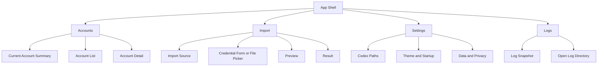
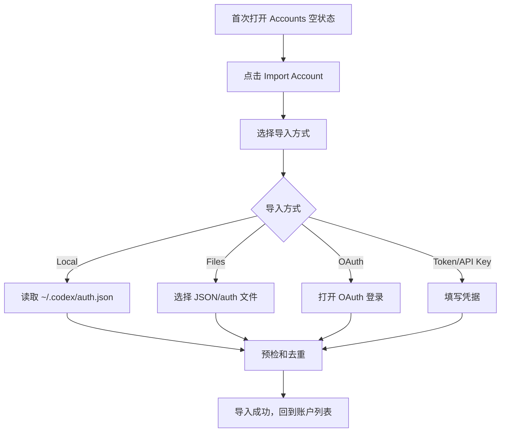
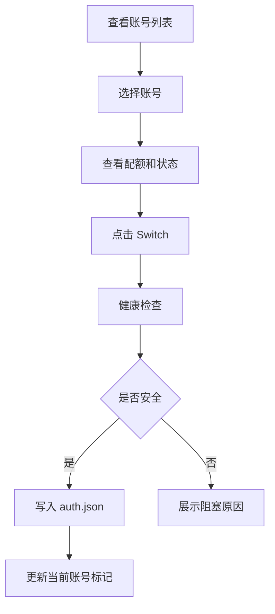

# UI/UX 规范文档: Codex Lite

## 文档信息

- **功能名称**：Codex Lite
- **版本**：1.0
- **创建日期**：2026-06-11
- **作者**：UI Designer Agent

## 摘要

> 下游 Agent 请优先阅读本节，需要细节时再查阅完整文档。

- **设计风格**：安静、克制、工具型桌面应用；强调可扫描、可执行、无广告干扰。
- **主色调**：墨绿 `#0F766E`，配合中性灰、琥珀警告、红色错误和蓝色信息。
- **核心组件**：账号列表行、配额条、当前账号栏、导入抽屉、切换确认弹窗、错误提示、设置表单、日志面板。
- **响应式断点**：桌面优先，最小窗口 900x620；窄屏下侧栏变为顶部 tabs，账号详情下移。
- **设计系统**：自建轻量组件，不做营销页面，不使用嵌套卡片和大面积装饰渐变。

---

## 1. 设计概述

### 1.1 设计理念

Codex Lite 的界面要像一个可靠的本地仪表工具：打开后立即看到“当前是谁、还有多少额度、能切到谁”。它不需要欢迎页、海报、赞助位或复杂平台导航。所有视觉资源都服务于三件事：导入、查看、切换。

### 1.2 设计原则

- **直接**：主页面就是账号和配额，不设置 landing page。
- **克制**：每屏只保留完成任务所需的信息和操作。
- **可扫描**：账号状态、配额、错误和当前账号标记在列表里一眼可见。
- **可恢复**：危险操作必须确认，切换失败要告诉用户原配置是否已恢复。
- **可信任**：敏感字段永远脱敏，导出或写入本机 auth 前明确提示影响。

---

## 2. 信息架构



### 2.1 主导航

桌面使用左侧窄导航，宽度 72px，仅图标 + tooltip：

- Accounts：账号
- Import：导入
- Settings：设置
- Logs：日志

不显示广告、公告、赞助、社区入口。产品名放在窗口左上，不抢主内容。

### 2.2 主界面布局

```text
+------------------------------------------------------------------------+
| Titlebar: Codex Lite                         [Refresh] [Import Account] |
+--------+---------------------------+-----------------------------------+
| Nav    | Current Account Summary   | Account Detail / Empty Hint       |
|        +---------------------------+                                   |
|        | Search / Filter / Sort    |                                   |
|        +---------------------------+                                   |
|        | Account List              |                                   |
|        | - account row             |                                   |
|        | - account row             |                                   |
|        | - account row             |                                   |
+--------+---------------------------+-----------------------------------+
```

主窗口建议默认 1180x760，最小 900x620。账号列表列宽 420px，详情区域自适应。

---

## 3. 用户流程

### 3.1 首次导入流程



### 3.2 日常切换流程



### 3.3 流程说明

| 步骤 | 页面/组件 | 用户行为 | 系统响应 |
| --- | --- | --- | --- |
| 1 | Accounts 空状态 | 点击导入 | 打开 Import Drawer |
| 2 | Import Drawer | 选择导入方式 | 展示对应表单或文件选择 |
| 3 | Import Preview | 确认导入 | 写入账号库，显示结果 |
| 4 | Account List | 点击账号行 | 右侧展示详情 |
| 5 | Account Detail | 点击 Switch | 执行健康检查和切换 |
| 6 | Toast / Status Bar | 查看结果 | 成功、失败或回滚状态明确反馈 |

---

## 4. 设计系统

### 4.1 颜色系统

#### 主色

| 名称 | 色值 | 用途 |
| --- | --- | --- |
| Primary | `#0F766E` | 主按钮、当前账号标记、选中态 |
| Primary Hover | `#0D9488` | 主按钮 hover |
| Primary Active | `#115E59` | 主按钮 active |
| Primary Soft | `#CCFBF1` | 当前账号背景、轻提示 |

#### 中性色

| 名称 | 色值 | 用途 |
| --- | --- | --- |
| Ink 900 | `#111827` | 主标题 |
| Ink 800 | `#1F2937` | 重要正文 |
| Ink 600 | `#4B5563` | 次要文字 |
| Ink 500 | `#6B7280` | 辅助文字 |
| Line 300 | `#D1D5DB` | 强边框 |
| Line 200 | `#E5E7EB` | 默认边框 |
| Surface 100 | `#F3F4F6` | 页面背景 |
| Surface 50 | `#F9FAFB` | 弱背景 |
| White | `#FFFFFF` | 内容面板 |

#### 语义色

| 名称 | 色值 | 背景 | 用途 |
| --- | --- | --- | --- |
| Success | `#059669` | `#D1FAE5` | 切换成功、可用 |
| Warning | `#D97706` | `#FEF3C7` | 配额低、数据过期 |
| Error | `#DC2626` | `#FEE2E2` | 导入失败、切换阻塞 |
| Info | `#2563EB` | `#DBEAFE` | 一般提示 |

#### 暗色模式

第一阶段可实现系统/浅色/深色。暗色不使用大面积蓝紫渐变，采用中性深灰：

| 语义 | 亮色 | 暗色 |
| --- | --- | --- |
| Background | `#F3F4F6` | `#111827` |
| Surface | `#FFFFFF` | `#1F2937` |
| Surface Muted | `#F9FAFB` | `#273244` |
| Text | `#111827` | `#F9FAFB` |
| Text Muted | `#6B7280` | `#9CA3AF` |
| Border | `#E5E7EB` | `#374151` |
| Primary | `#0F766E` | `#2DD4BF` |

### 4.2 字体系统

| 层级 | 字号 | 行高 | 字重 | 用途 |
| --- | --- | --- | --- | --- |
| Page Title | 22px | 30px | 650 | 主页面标题 |
| Section Title | 16px | 24px | 650 | 面板标题 |
| Row Title | 14px | 20px | 600 | 账号名 |
| Body | 14px | 20px | 400 | 正文和表单 |
| Caption | 12px | 16px | 400 | 辅助信息 |
| Mono | 12px | 18px | 400 | 路径、ID、日志 |

字体族：

- Sans: `Inter`, `-apple-system`, `BlinkMacSystemFont`, `"Segoe UI"`, `"PingFang SC"`, `"Microsoft YaHei"`, `sans-serif`
- Mono: `"SF Mono"`, `"Cascadia Code"`, `"JetBrains Mono"`, `monospace`

### 4.3 间距系统

使用 4px 基准：

| Token | 值 | 用途 |
| --- | --- | --- |
| `space-1` | 4px | 图标和文字 |
| `space-2` | 8px | 紧密组内 |
| `space-3` | 12px | 表单行内 |
| `space-4` | 16px | 面板内边距 |
| `space-5` | 20px | 区块间 |
| `space-6` | 24px | 页面主间距 |
| `space-8` | 32px | 大区块 |

### 4.4 圆角和边框

| Token | 值 | 用途 |
| --- | --- | --- |
| `radius-sm` | 4px | Badge、进度条 |
| `radius-md` | 6px | 输入框、小按钮 |
| `radius-lg` | 8px | 面板、列表行、弹窗 |
| `radius-full` | 999px | 状态点、胶囊标签 |

卡片和面板圆角不超过 8px。页面区块不做“卡片套卡片”，账号行可以作为重复项卡片。

### 4.5 阴影

| Token | 值 | 用途 |
| --- | --- | --- |
| `shadow-popover` | `0 10px 24px rgba(15,23,42,0.12)` | 下拉、tooltip |
| `shadow-modal` | `0 20px 48px rgba(15,23,42,0.22)` | Modal / Drawer |

普通面板主要靠边框和背景区分，不默认使用厚阴影。

### 4.6 动效

| Token | 值 | 用途 |
| --- | --- | --- |
| `duration-fast` | 120ms | hover、focus |
| `duration-normal` | 180ms | 抽屉、弹窗 |
| `ease-standard` | `cubic-bezier(0.2,0,0,1)` | 状态变化 |

动效只用于反馈，不做装饰动画。尊重 `prefers-reduced-motion`。

---

## 5. 组件规范

### 5.1 App Shell

- 左侧导航 72px，背景 `White`，右边 1px border。
- 顶栏 56px，左侧页面标题，右侧放刷新和导入主操作。
- 内容区背景 `Surface 100`，内部左右面板使用 `White` + 1px border。
- 窄屏下导航变为顶部 segmented tabs。

### 5.2 Account Row

高度 88px，结构固定，避免刷新配额时跳动：

```text
+------------------------------------------------+
| Avatar | Display Name         [Current] [State] |
|        | email@example.com                      |
|        | Hourly bar     Weekly bar       Reset  |
+------------------------------------------------+
```

状态：

- Default：白底，边框 `Line 200`。
- Hover：背景 `Surface 50`。
- Selected：边框 `Primary`，左侧 3px primary indicator。
- Current：展示 `Current` badge，不依赖颜色作为唯一信息。
- Error：右侧展示 error badge，配额条变为 muted。

### 5.3 Quota Meter

- 两条细进度条：Hourly 和 Weekly。
- 高度 6px，圆角 4px。
- 颜色规则：
  - `>= 40%`：Success
  - `15%-39%`：Warning
  - `< 15%`：Error
  - Unknown：`Line 300`
- 必须显示文字百分比，不能只靠颜色。

### 5.4 Account Detail

右侧详情包含：

- Header：账号名、当前状态、操作菜单。
- Quota Overview：Hourly / Weekly 两个并列指标。
- Credential Summary：Auth mode、Account ID、Plan、Last refresh，敏感值脱敏。
- Actions：Switch、Refresh quota、Rename、Delete。
- Diagnostics：最近错误、数据更新时间、日志入口。

Switch 是详情里的唯一 primary button。Delete 使用 danger ghost，并放入更多菜单或底部危险区。

### 5.5 Import Drawer

宽度 480px，从右侧滑入。用于所有导入方式，避免新开多个页面。

导入方式用 icon + label 的单选列表：

- Current local auth
- JSON / auth file
- Batch files
- OAuth login
- Token
- API Key

每种方式下方展示对应表单。底部固定操作区：Cancel / Continue / Import。

### 5.6 Batch Import Preview

使用表格，不用卡片堆叠：

| Select | Source | Account | Type | Quota Check | Status |
| --- | --- | --- | --- | --- | --- |

行状态：

- Importable：默认勾选。
- Existing：默认不勾选，状态为 Existing。
- Failed：不可勾选，显示原因。

### 5.7 Confirm Switch Modal

当目标账号健康检查通过但会覆盖当前 `auth.json` 时展示：

- 标题：Switch Codex account
- 内容：From 当前账号 -> To 目标账号
- 安全说明：会先备份当前 auth，失败会尝试恢复。
- 按钮：Cancel / Switch

如果目标账号是当前账号，不弹窗，按钮 disabled 并提示 Already current。

### 5.8 Error Banner

用于当前账号读取失败、路径无权限、OAuth 端口占用等阻塞错误。出现在主内容顶部，不用 toast 承载长期错误。

结构：

- 图标
- 错误标题
- 简短说明
- 操作按钮，例如 Retry、Open Settings、Open Logs

### 5.9 Settings Form

设置页分为三组：

- Codex paths：Codex home、auth path、检测按钮。
- App behavior：theme、refresh on start。
- Data and privacy：open data dir、open logs、export warning。

路径使用 mono 字体，提供复制和重新检测图标按钮。

### 5.10 Logs Panel

日志页是只读工具视图：

- 顶部：Refresh、Open log directory。
- 主体：等宽字体日志列表。
- 支持错误级别筛选：All / Error / Warn / Info。
- 敏感字段显示 `[REDACTED]`。

---

## 6. 页面设计

### 6.1 Accounts Page

默认首页。左侧账号列表，右侧详情。

关键元素：

- Current Account Summary：展示当前账号和最后检查时间。
- Search Input：按名称、邮箱、标签搜索。
- Sort Menu：Last used、Quota low first、Name。
- Refresh All icon button。
- Import Account primary button。
- Account List。
- Account Detail。

空状态：

- 标题：No Codex accounts yet
- 文案：Import your current local Codex auth or add another account.
- 主操作：Import Account
- 次操作：Open settings

### 6.2 Import Drawer

适用于 Accounts Page 和 Import nav。

步骤：

1. Choose source
2. Provide credentials or files
3. Preview
4. Result

结果页展示 success / skipped / failed summary，失败项可展开看原因。

### 6.3 Settings Page

不做过多配置。只放必要路径、主题和数据目录入口。

布局为单列表单，最大宽度 760px，左对齐，不居中大卡片。

### 6.4 Logs Page

面向排障。保留最近 N 行，默认 N=300。错误详情可以复制，但复制内容同样脱敏。

---

## 7. 交互规范

### 7.1 加载状态

| 场景 | 表现 |
| --- | --- |
| 启动加载账号 | 账号列表 skeleton，右侧显示空详情 skeleton |
| 刷新单账号配额 | 对应账号行右侧小 spinner，进度条保留旧值 |
| 刷新全部 | 顶栏 Refresh icon 旋转，列表逐行更新 |
| 导入 | Drawer footer button loading，表单 disabled |
| 切换 | Switch button loading，当前账号标记保持到成功后更新 |

### 7.2 成功反馈

- 导入成功：toast + 账号自动选中。
- 切换成功：toast + Current badge 更新 + summary 更新。
- 刷新成功：不弹 toast，只更新时间；用户主动刷新全部可显示轻量 toast。

### 7.3 错误反馈

- 短暂错误：toast，例如单次刷新失败。
- 持续阻塞：error banner，例如 auth path 不存在。
- 表单错误：字段下方 inline error。
- 批量导入错误：preview 行内 error，不用全局 toast 淹没信息。

### 7.4 键盘交互

- `Cmd/Ctrl + R`：刷新当前选中账号配额。
- `Cmd/Ctrl + I`：打开导入抽屉。
- `Cmd/Ctrl + ,`：打开设置。
- `Esc`：关闭 drawer、modal、popover。
- 上下方向键：账号列表内移动选中。
- `Enter`：打开选中账号详情，不直接切换账号。

快捷键不在主界面用大段文字解释；可放在 tooltip 或后续命令菜单。

---

## 8. 无障碍设计

- 所有按钮、输入框、账号行、导航项可键盘聚焦。
- 焦点环使用 `2px #0F766E`，外扩 2px。
- 账号当前状态不能只靠颜色，必须有文字 `Current`。
- 配额状态不能只靠颜色，必须显示百分比和状态文本。
- Toast 使用 `aria-live="polite"`；错误 banner 使用 `role="alert"`。
- Modal / Drawer 打开时锁定焦点，关闭后返回触发按钮。
- 文本对比度满足 WCAG AA。

---

## 9. 实现约束

- 不做 landing page、hero、营销图、广告位。
- 不使用大面积渐变、装饰光斑、嵌套卡片。
- 页面内容不要被说明性文案占满；文案短而动作明确。
- 图标使用 lucide-react，不手写 SVG。
- 账号行、按钮、导航项必须有稳定尺寸，动态数据不能撑破布局。
- 敏感字段只显示末尾 4-6 位，例如 `sk-...A19f`。

---

## 输出检查清单

- [x] `.boss/codex-lite/ui-spec.md` 已写入。
- [x] `.boss/codex-lite/ui-design.json` 已写入。
- [x] Markdown 说明与 JSON 约束无冲突。

[BOSS_STATUS]
status: DONE_WITH_CONCERNS
summary: 已完成 Codex Lite UI/UX 规范，明确桌面工具型布局、设计系统、核心页面、组件和交互状态。
concerns: 需要实现阶段用真实数据检查账号行、配额条和批量导入表格在长邮箱、长路径、多错误状态下是否溢出。
[/BOSS_STATUS]
