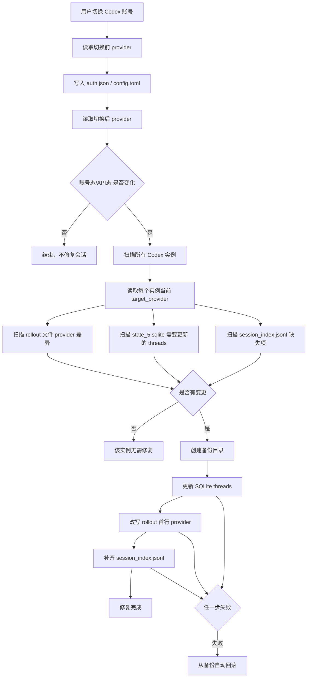

# Codex 会话可见性恢复流程

本文档总结 `cockpit-tools-fuck-main` 项目中，在 Codex 账号态与 API 模式之间切换时，如何保留历史会话可见性。

## 背景

Codex 的历史会话不只依赖 `auth.json` 和 `config.toml`。会话列表和可见性还依赖以下文件中的 provider 元数据：

- `sessions/**/rollout-*.jsonl`
- `archived_sessions/**/rollout-*.jsonl`
- `session_index.jsonl`
- `state_5.sqlite`

当用户从 OAuth 账号切到 API 模式时，`config.toml` 中的当前 provider 会从默认 `openai` 变为 API provider，例如 `codex_local_access`。如果历史会话仍记录为 `openai`，Codex App 可能不再显示这些会话。

因此项目没有移动或复制对话内容，而是修复历史会话里的 provider 元数据，使它们与当前 provider 一致。

## 触发条件

切换账号时会在写入前后读取当前 provider：

1. 切换前读取 `config.toml` 中的 `model_provider`。
2. 写入新的 `auth.json` 和 `config.toml`。
3. 切换后再次读取 `model_provider`。
4. 如果 provider 类型从账号态变成 API 态，或从 API 态变回账号态，则执行修复。

判断规则：

```text
provider == "openai"    => 账号态
provider != "openai"    => API/provider 态
```

示例：

```text
openai -> codex_local_access        触发修复
codex_local_access -> openai        触发修复
codex_local_access -> relay         不触发修复，二者都属于 API 态
openai -> openai                    不触发修复
```

相关入口：

- `src-tauri/src/commands/codex.rs::switch_codex_account`
- `src-tauri/src/commands/codex.rs::repair_codex_session_visibility_after_provider_change`

## 涉及目录

修复会扫描所有 Codex 实例：

- 默认实例：`~/.codex`
- Cockpit 管理的多开实例：每个实例自己的 `user_data_dir`

每个实例目录中会处理：

```text
<codex_home>/
  config.toml
  sessions/
  archived_sessions/
  session_index.jsonl
  state_5.sqlite
```

实例收集逻辑：

- 默认实例来自 `codex_instance::get_default_codex_home()`
- 多开实例来自 `codex_instance::load_instance_store()`

## 总体流程



## 步骤 1：读取目标 Provider

每个实例都会读取自己的 `config.toml`：

```text
<codex_home>/config.toml
```

读取逻辑：

- 如果文件不存在，目标 provider 默认为 `openai`
- 如果 `model_provider` 不存在，目标 provider 默认为 `openai`
- 否则使用 `model_provider` 的值

示例：

```toml
model_provider = "codex_local_access"
```

则该实例的目标 provider 是：

```text
codex_local_access
```

相关函数：

- `codex_session_visibility.rs::read_target_provider`

## 步骤 2：扫描 Rollout 文件

扫描目录：

```text
sessions/
archived_sessions/
```

只处理文件名符合以下格式的文件：

```text
rollout-*.jsonl
```

每个 rollout 文件的首行通常是 `session_meta`：

```json
{"type":"session_meta","payload":{"id":"xxx","model_provider":"openai"}}
```

如果 `payload.model_provider` 与当前目标 provider 不一致，则记录为待修复。

修复时只改首行中的 `model_provider`：

```json
{"type":"session_meta","payload":{"id":"xxx","model_provider":"codex_local_access"}}
```

注意：

- 不改后续对话内容。
- 不改消息事件。
- 修复后会恢复文件修改时间，避免历史会话排序被扰动。

相关函数：

- `collect_rollout_provider_changes`
- `rewrite_rollout_provider`

## 步骤 3：更新 SQLite 线程记录

处理数据库：

```text
<codex_home>/state_5.sqlite
```

目标表：

```text
threads
```

如果表中存在对应字段，会更新：

```sql
model_provider = 当前目标 provider
has_user_event = 1
thread_source = 'user'
```

更新条件包括：

- `model_provider` 与目标 provider 不一致
- 有 `first_user_message`，但 `has_user_event` 不是 `1`
- 有 `first_user_message`，但 `thread_source` 为空

这一步的意义是让 SQLite 中的线程记录也被 Codex 视为当前 provider 下的可见用户会话。

相关函数：

- `count_sqlite_rows_to_update`
- `update_sqlite_provider`
- `build_threads_repair_where_clause`
- `build_threads_repair_set_clause`

## 步骤 4：补齐 Session Index

处理索引文件：

```text
<codex_home>/session_index.jsonl
```

如果 SQLite 的 `threads` 表中有某个 thread，但 `session_index.jsonl` 没有对应记录，则追加一行：

```json
{"id":"thread-id","thread_name":"Title","updated_at":"2026-06-15T00:00:00.000000Z"}
```

字段来源：

- `id` 来自 SQLite `threads.id`
- `thread_name` 来自 SQLite `threads.title`
- `updated_at` 来自 SQLite `threads.updated_at`

如果 title 为空，则使用：

```text
Untitled
```

相关函数：

- `count_missing_session_index_entries`
- `reconcile_session_index_from_sqlite`
- `build_session_index_entry_from_thread`

## 步骤 5：备份与回滚

只要某个实例需要修改，就会先创建备份目录：

```text
<codex_home>/backup-YYYYMMDD-HHMMSS-session-visibility-repair/
```

备份内容包括：

- 待修改的 rollout 文件
- `state_5.sqlite`
- `session_index.jsonl`
- `manifest.json`

SQLite 备份使用：

```sql
VACUUM main INTO ?
```

这样可以得到一致的数据库快照。

如果修复中途失败，会尝试自动回滚：

- 恢复 rollout 文件
- 恢复 `state_5.sqlite`
- 恢复 `session_index.jsonl`
- 清理 SQLite 的 `-wal` / `-shm` sidecar 文件

相关函数：

- `backup_instance_files`
- `backup_sqlite_database`
- `restore_instance_files_from_backup`
- `restore_sqlite_database_from_backup`

## 步骤 6：清理旧备份

项目只保留最近一次会话可见性修复备份：

```text
MAX_SESSION_VISIBILITY_REPAIR_BACKUPS = 1
```

多余的旧备份会被删除。

相关函数：

- `prune_session_visibility_repair_backups`
- `prune_instance_session_visibility_repair_backups`

## 伪代码

```rust
fn switch_codex_account(account_id) {
    let codex_home = get_codex_home();
    let before_provider = read_history_visibility_provider_for_dir(codex_home);

    switch_account_managed(account_id);

    let after_provider = read_history_visibility_provider_for_dir(codex_home);

    if credential_kind(before_provider) != credential_kind(after_provider) {
        repair_session_visibility_across_instances();
    }
}
```

```rust
fn repair_session_visibility_across_instances() {
    for instance in collect_instances() {
        let target_provider = read_target_provider(instance.data_dir);

        let rollout_changes =
            collect_rollout_provider_changes(instance.data_dir, target_provider);

        let sqlite_rows =
            count_sqlite_rows_to_update(instance.data_dir, target_provider);

        let missing_index_entries =
            count_missing_session_index_entries(instance.data_dir);

        if no_changes {
            continue;
        }

        let backup_dir = backup_instance_files(...);

        match repair_single_instance(...) {
            Ok(_) => continue,
            Err(_) => restore_instance_files_from_backup(...),
        }
    }
}
```

## 修复前后示例

切换前：

```toml
# config.toml
# 无 model_provider，等价于 openai
```

历史 rollout：

```json
{"type":"session_meta","payload":{"id":"s1","model_provider":"openai"}}
```

切换到 API 模式后：

```toml
model_provider = "codex_local_access"

[model_providers.codex_local_access]
name = "Relay"
base_url = "https://relay.example.com/v1"
wire_api = "responses"
requires_openai_auth = true
experimental_bearer_token = "sk-..."
supports_websockets = false
```

修复后的 rollout：

```json
{"type":"session_meta","payload":{"id":"s1","model_provider":"codex_local_access"}}
```

SQLite 中对应 thread：

```text
model_provider = codex_local_access
has_user_event = 1
thread_source = user
```

## 注意事项

- 修复的是会话可见性，不是会话内容。
- 不会复制或合并对话正文。
- 主要修改 rollout 首行 metadata、SQLite thread metadata、session index。
- 如果 Codex App 正在运行，SQLite 可能被占用，项目会提示关闭 Codex 后重试。
- 修复运行中的实例后，Codex App 可能需要刷新或重启才能显示。
- provider 同属 API 态时不会触发修复，例如 `codex_local_access -> relay`。
- 账号态与 API 态互切才会触发修复，例如 `openai -> codex_local_access`。

## 关键源码位置

- `src-tauri/src/commands/codex.rs`
  - `switch_codex_account`
  - `repair_codex_session_visibility_after_provider_change`
- `src-tauri/src/modules/codex_account.rs`
  - `switch_account_managed`
  - `write_api_key_provider_to_config_toml`
  - `write_prepared_account_bundle_to_dir`
- `src-tauri/src/modules/codex_session_visibility.rs`
  - `repair_session_visibility_across_instances`
  - `read_target_provider`
  - `collect_rollout_provider_changes`
  - `rewrite_rollout_provider`
  - `update_sqlite_provider`
  - `reconcile_session_index_from_sqlite`
  - `backup_instance_files`

